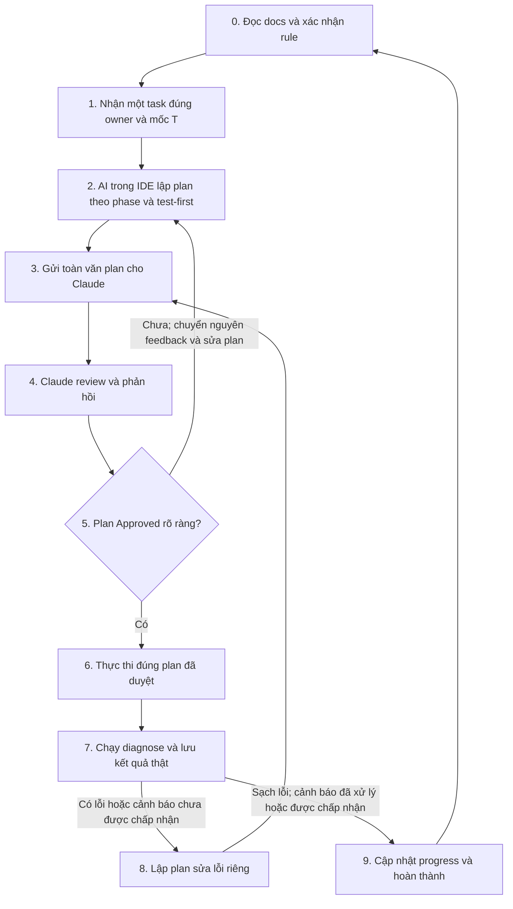

# Quy trình thực hiện Task Backend — áp dụng cho mọi Task T1/T2/T3

Quy trình này áp dụng cho cả 5 thành viên Backend. Phạm vi task và người sở hữu lấy từ [kế hoạch chia việc Backend](backend-work-plan.md); nguồn quy tắc kỹ thuật nằm trong [Architecture Rules](rules/README.md); cách ghi kết quả nằm trong [hướng dẫn nhật ký tiến độ](../progress/README.md). Quy trình này không thay đổi ownership, contract đã khóa hoặc Schema Freeze.

Người thực hiện chịu trách nhiệm xác nhận từng bước đã xảy ra thật. Không coi AI trong IDE hoặc Claude là đã đọc, đã chạy test hay đã phê duyệt nếu không có phản hồi hoặc kết quả thực tế để đối chiếu. Claude review là bước chuyển giao thủ công qua người thực hiện, không phải tích hợp tự động.

## Sơ đồ vòng lặp

Không làm song song nhiều task chưa có plan được duyệt. Một task đi hết vòng lặp trước khi nhận task tiếp theo.

## Bước 0 — Đọc docs trước khi lập plan

AI trong IDE phải đọc đầy đủ [architecture-decisions.md](rules/architecture-decisions.md) và [testing-quality-gates.md](rules/testing-quality-gates.md) cho **mọi task**, rồi đọc các rule liên quan trực tiếp:

| Task liên quan | Rule cần đọc |
|---|---|
| API, endpoint, DTO hoặc response | [api-conventions.md](rules/api-conventions.md) |
| Bảng, migration, index hoặc repository | [db-schema-rules.md](rules/db-schema-rules.md) |
| Nghiệp vụ hoặc validation | [business-rules.md](rules/business-rules.md) |
| Auth, role, ownership hoặc RLS | [auth-rbac-rls.md](rules/auth-rbac-rls.md) |
| Checkout, Order, Payment hoặc Shipment | [order-workflow-transactions.md](rules/order-workflow-transactions.md) |
| Lỗi, log hoặc observability | [error-observability.md](rules/error-observability.md) |

Một task có thể cần nhiều rule trong bảng. Trước khi lập plan, AI nêu 1–2 câu xác nhận đã đọc những file nào và mục/QD/RB nào chi phối task. Nếu không thể xác nhận bằng nội dung thực của file, dừng ở bước này; không lập plan dựa trên suy đoán hoặc bịa mã rule.

## Bước 1 — Nhận đúng một task

- Lấy một việc thuộc owner và mốc T hiện tại trong [kế hoạch Backend](backend-work-plan.md). Có thể lấy việc thuộc nhóm **Làm được ngay**, hoặc nhóm **Phải chờ** khi đầu ra phụ thuộc đã được bàn giao và đạt contract test.
- Không gộp các task độc lập thành một plan. Xác định đầu ra, ranh giới file/module và tiêu chí hoàn thành của task trước khi lập plan.
- Nếu input chưa sẵn sàng, áp dụng mục “Quy tắc khi dependency chưa sẵn sàng” của kế hoạch Backend: làm test bằng mock/stub theo contract đã khóa, ghi rõ đang chờ ai và đầu ra nào; không tự sửa phần người khác.

## Bước 2 — AI trong IDE lập plan

Plan phải dựa trên đúng docs đã đọc ở Bước 0 và có các phần sau:

1. Task, owner, mốc T, đầu ra và dependency đã đáp ứng.
2. Các file dự kiến tạo/sửa; xác nhận không vượt ownership hoặc thay contract của người khác.
3. Các phase theo thứ tự. Mỗi phase nêu **test/check viết hoặc chạy trước**, test case cụ thể với input, expected output và edge case, sau đó mới nêu implementation và refactor.
4. Với từng phase, trích dẫn **mục hoặc mã QD/RB có thật, kèm file rule tương ứng**; không ghi chung chung “theo business rules”. Nếu không có QD/RB chuyên biệt, dẫn mục rule phù hợp và nói rõ không có mã QD/RB riêng.
5. Lệnh kiểm tra cuối task và điều kiện đạt. Không dùng câu mơ hồ như “viết test cho module X”; ghi tên test case hoặc tình huống kiểm thử cụ thể.

Với task code, giữ thứ tự TDD: test fail vì hành vi còn thiếu → implement tối thiểu để pass → refactor và chạy lại test. Với task chỉ sửa tài liệu hoặc cấu hình, viết/chạy kiểm tra phù hợp trước khi sửa (liên kết, cấu trúc, cấu hình hoặc acceptance check); không tạo unit test giả cho công việc không có mã chạy.

## Bước 3 — Gửi toàn văn plan cho Claude review

Người thực hiện gửi **toàn văn**, không tóm tắt. Claude kiểm tra căn cứ Architecture Rules, tính đúng của trích dẫn QD/RB, edge case, test-first, thứ tự phase, ownership, dependency và tác động tới public contract. Lưu tham chiếu tới cuộc trao đổi hoặc PR có phản hồi để về sau kiểm chứng việc duyệt.

## Bước 4 — Nhận phản hồi review

Nếu có vấn đề, Claude nêu rõ điểm cần sửa và lý do. Người thực hiện chuyển đúng nội dung góp ý cho AI trong IDE, không tự diễn giải thành yêu cầu khác và không bắt đầu code trong lúc plan đang sửa.

## Bước 5 — Lặp tới `Plan Approved`

AI sửa toàn văn plan theo feedback rồi lặp Bước 3–4. Chỉ phản hồi duyệt **rõ ràng** của Claude cho đúng phiên bản plan hiện tại mới được coi là `Plan Approved`. Phản hồi im lặng, chưa review hết hoặc chỉ khen một phần không phải phê duyệt. Nếu plan đổi sau khi được duyệt, phải gửi lại phần plan đã đổi để review trước khi thực thi.

## Bước 6 — Thực thi đúng plan đã duyệt

- Làm đủ các phase theo thứ tự test-first đã duyệt; test phải chạy thật, ghi nhận fail/pass thật và không tạo test giả để qua CI.
- Không bỏ test bằng `.skip`, comment hoặc nới lỏng assertion để né lỗi.
- Không tự thêm rule, đổi contract, mở rộng ownership hoặc nới validation ngoài plan. Nếu gặp vấn đề ngoài plan hoặc cần quyết định mới, dừng phần bị ảnh hưởng, cập nhật plan và quay lại Bước 3; phần không bị ảnh hưởng chỉ tiếp tục khi vẫn nằm trong plan đã duyệt.
- Không tự sửa file của owner khác. Thay đổi Schema Freeze hoặc state machine phải qua Change Request `Approved` theo kế hoạch Backend.

## Bước 7 — Diagnose sau thực thi

Chạy thực tế lint, typecheck, build và toàn bộ test liên quan đến task theo dự án tại thời điểm thực hiện; thêm các kiểm tra mà plan và [testing-quality-gates.md](rules/testing-quality-gates.md) yêu cầu. Với task không có mã chạy, chạy acceptance check phù hợp đã ghi trong plan. Lưu lệnh đã chạy, kết quả và **nguyên văn** lỗi/cảnh báo; không ghi “pass” khi lệnh chưa chạy hoặc môi trường không cho chạy.

“Sạch lỗi” nghĩa là các kiểm tra bắt buộc đã chạy và không còn lỗi. Cảnh báo phải được xử lý hoặc được reviewer chấp nhận rõ ràng trước khi Done. Nếu kiểm tra không chạy được, ghi nguyên nhân và coi task chưa hoàn thành.

## Bước 8 — Nếu diagnose có lỗi

Không sửa tùy hứng trong code. Lập **plan sửa lỗi riêng**: lỗi và output nguyên văn, nguyên nhân được kiểm chứng hoặc giả thuyết cần thử, test tái hiện lỗi, file dự kiến sửa, ảnh hưởng contract/ownership và lệnh diagnose lại. Gửi toàn văn plan sửa cho Claude theo Bước 3, lặp review đến `Plan Approved`, rồi thực thi và chạy lại Bước 7. Lặp cho tới khi đạt điều kiện sạch lỗi.

## Bước 9 — Hoàn thành và cập nhật tiến độ

Sau khi đạt Bước 7, owner cập nhật đúng nhật ký của mình:

- [Người 1 — Platform](../progress/nguoi-1-platform.md)
- [Người 2 — Database](../progress/nguoi-2-database.md)
- [Người 3 — Catalog](../progress/nguoi-3-catalog.md)
- [Người 4 — Buyer domain](../progress/nguoi-4-buyer-domain.md)
- [Người 5 — Transaction](../progress/nguoi-5-transaction.md)

Ghi theo [template chuẩn](../progress/README.md): ngày và việc đã làm, quyết định kỹ thuật, contract/port thay đổi hoặc `Không`, blocker, test thực sự đã chạy cùng kết quả và mã QD/RB nếu có. Dẫn tham chiếu phản hồi `Plan Approved` và kết quả diagnose trong mục nhật ký phù hợp. Chỉ đánh dấu checkbox task hoàn thành khi đầu ra và bằng chứng kiểm tra có thật; sau đó mới quay về Bước 0 cho task tiếp theo. Người 1 đồng bộ bảng tổng quan README khi có thay đổi lớn hoặc tại review cuối T.
