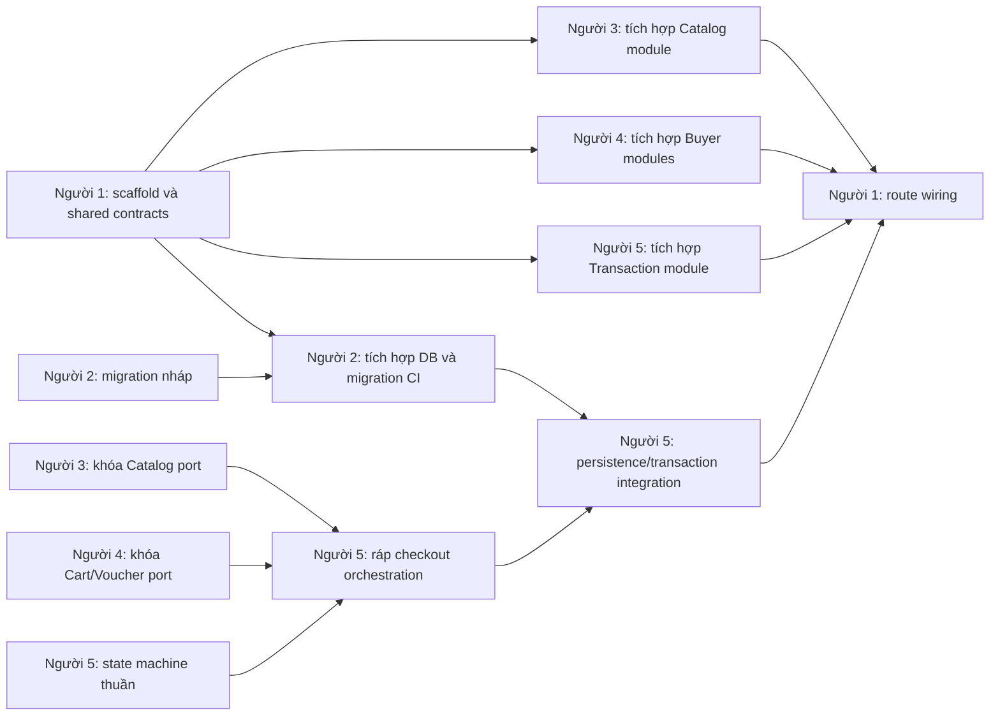
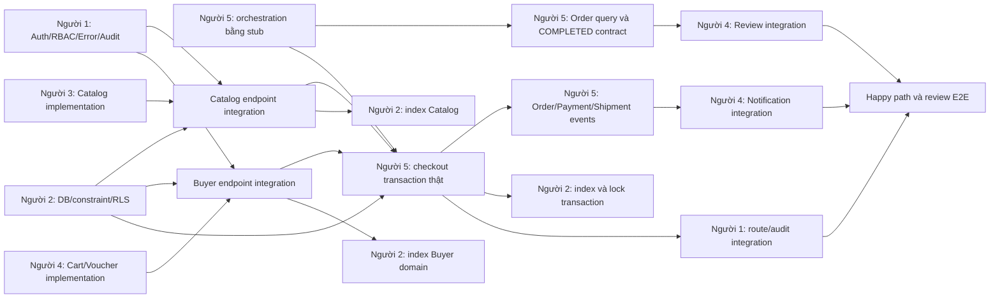
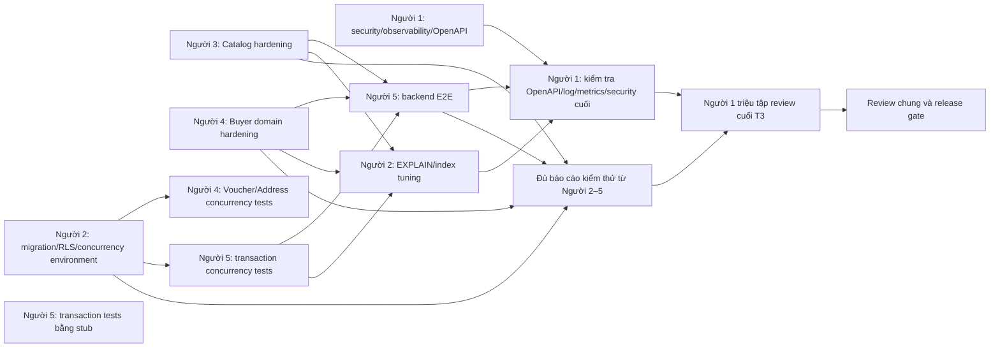

# Kế hoạch chia việc Backend cho 5 người theo T1, T2, T3

## 1. Ownership và quy tắc phối hợp

Backend đặt tại `D:\E-Commerce Platform\backend`. Không triển khai frontend trong ba mốc này.

| Người | Vai trò | Phạm vi sở hữu |
|---|---|---|
| Người 1 | Platform và Integration Lead | `src/platform`, `src/modules/identity`, `moderation`, `admin-log`, cấu hình chung |
| Người 2 | Database và Supabase | `db`, `supabase`, migrations, seed, RLS, Storage policy |
| Người 3 | Catalog và Seller domain | `shop`, `category`, `product`, `product-variant`, `media` |
| Người 4 | Buyer supporting domain | `profile`, `address`, `cart`, `voucher`, `review`, `notification` |
| Người 5 | Transaction core | `checkout`, `order`, `payment`, `shipment`, `reporting` |

Quy tắc chống dẫm chân:

- Chỉ owner được sửa trực tiếp thư mục của mình.
- `package.json`, app bootstrap, middleware chung, API envelope và `src/contracts` do Người 1 sở hữu.
- Chỉ Người 2 tạo hoặc sửa migration; owner domain gửi yêu cầu schema cho Người 2.
- Repository của domain nằm trong domain đó và do owner domain quản lý.
- Người 5 sở hữu toàn bộ transaction checkout; Người 3 và 4 cung cấp service contract để checkout gọi.
- Thay đổi public contract sau T1 phải được owner cung cấp và owner tiêu thụ cùng duyệt.
- Thay đổi Schema Freeze hoặc state machine phải có Change Request `Approved`.

Các contract khóa ở T1:

- `RequestContext`: `request_id`, `user_id`, `role`, `shop_id?`.
- Catalog port: khóa variant, đọc giá/tồn/status.
- Voucher port: kiểm tra và tiêu thụ voucher trong transaction.
- Cart port: lấy các dòng được chọn và đánh dấu đã checkout.
- Audit port: ghi AdminLog cùng transaction.
- API dùng `/api/v1`, envelope và error code theo Architecture Rules.

Nếu đã xong phần làm ngay mà dependency chưa sẵn sàng, owner tiếp tục viết unit/contract test bằng mock hoặc stub theo contract đã khóa; hoàn thiện validation, negative test, error mapping, fixture và tài liệu thuộc domain mình. Người đang chờ ghi rõ owner cung cấp, đầu ra cần bàn giao và tiêu chí nghiệm thu trong dependency ticket. Không tự sửa phần của owner khác hoặc tạo contract thay thế. “Chờ Người N xong” trong kế hoạch nghĩa là đầu ra nêu rõ đã được bàn giao và đạt contract test, không chỉ là có bản nháp.

## 2. T1 — Nền tảng và khóa hợp đồng

### Thứ tự thực hiện trong T1

#### Người 1

**Làm được ngay, không cần chờ ai**

- Scaffold Payload/Node.js backend, cấu trúc module, `package.json` và TypeScript.
- Thiết lập test runner, lint, typecheck, build và CI skeleton.
- Cài API envelope, request ID, error middleware và health endpoint.
- Định nghĩa `RequestContext`, shared contract folder, naming convention và Auth repository interface để phát triển middleware bằng stub.
- Khóa contract dùng chung và soạn tài liệu API ban đầu.

**Phải chờ người khác xong trước khi bắt đầu**

- Chờ **Người 2 xong migration `app_users`, seed User và database connection** → xác minh Supabase JWT, chặn User `LOCKED` và chạy auth smoke test với database thật.
- Chờ **Người 3 xong endpoint DTO và khóa Catalog port** → wiring route Catalog.
- Chờ **Người 4 xong và khóa Cart/Voucher port** → wiring route Cart/Voucher.
- Chờ **Người 5 xong checkout/order command và response contract** → wiring route checkout/order.

#### Người 2

**Làm được ngay, không cần chờ ai**

- Chuyển đủ 22 bảng Schema Freeze v1 thành migration SQL nháp; xác định PK, FK, CHECK, UNIQUE và partial unique index bắt buộc.
- Soạn RLS default-deny policy, seed tối thiểu, Supabase Auth/Storage configuration mẫu và `.env.example`.
- Xác định interface cho database client, transaction helper và test database.

**Phải chờ người khác xong trước khi bắt đầu**

- Chờ **Người 1 xong scaffold và cấu trúc config** → tích hợp migration, database client và transaction helper vào backend.
- Chờ **Người 1 xong test runner và CI skeleton** → tích hợp migration CI.
- Chờ **Người 1 khóa `RequestContext` và identity repository interface** → chạy auth seed và identity sync test.
- Chờ **Người 3, 4 và 5 công bố query pattern của từng domain** → kiểm tra query/index theo cách sử dụng thực tế.

#### Người 3

**Làm được ngay, không cần chờ ai**

- Thiết kế domain model, DTO, validation và repository interface cho Shop, Category, Product, ProductVariant và ProductImage.
- Soạn endpoint contract cho public catalog và Seller catalog.
- Định nghĩa, công bố Catalog port cho Người 5: khóa variant, đọc giá, tồn và status.
- Viết unit test thuần cho price, stock, SKU và Seller ownership.

**Phải chờ người khác xong trước khi bắt đầu**

- Chờ **Người 1 xong scaffold và cấu trúc module** → đặt Catalog module vào backend.
- Chờ **Người 1 xong shared contract structure** → đưa Catalog port vào `src/contracts`.
- Chờ **Người 2 xong migration Shop/Product/Variant/Image và database client** → chạy repository integration test.
- Chờ **Người 1 xong `RequestContext` và auth middleware contract** → wiring authenticated endpoint.

#### Người 4

**Làm được ngay, không cần chờ ai**

- Thiết kế model, DTO, validation và repository interface cho Profile, Address, Cart, Voucher, Review và Notification.
- Định nghĩa, công bố Cart port và Voucher port cho Người 5.
- Soạn endpoint contract cho Buyer supporting domain và mock fixture theo Schema Freeze.
- Viết unit test thuần cho cart quantity, voucher rule, rating và default address.

**Phải chờ người khác xong trước khi bắt đầu**

- Chờ **Người 1 xong scaffold và cấu trúc module** → đặt Buyer modules vào backend.
- Chờ **Người 1 xong shared contract structure** → đưa Cart/Voucher port vào `src/contracts`.
- Chờ **Người 2 xong migration các bảng liên quan và database client** → chạy repository integration test.
- Chờ **Người 1 khóa `RequestContext`** → wiring endpoint cần kiểm tra ownership.
- Chờ **Người 5 khóa Order query/state contract** → tích hợp Review với Order thật.

#### Người 5

**Làm được ngay, không cần chờ ai**

- Xây domain service thuần cho ba state machine Order, Payment và Shipment.
- Viết unit test cho mọi transition hợp lệ, transition bị cấm và terminal state.
- Thiết kế checkout command/result, transaction boundary, danh sách bước checkout và idempotency interface.
- Khóa endpoint contract tạo Order, cancel, transition và retry Payment.
- Dùng mock Catalog, Cart và Voucher port để kiểm thử orchestration contract.

**Phải chờ người khác xong trước khi bắt đầu**

- Chờ **Người 3 khóa Catalog port** và **Người 4 khóa Cart port, Voucher port** → mới ráp checkout orchestration với các port thật. Phần state machine thuần phía trên không phải chờ.
- Chờ **Người 2 xong migration và transaction helper** → làm persistence, transaction integration và idempotency storage thật.
- Chờ **Người 1 xong scaffold, API envelope và `RequestContext`** → wiring endpoint.

#### Chuỗi phụ thuộc T1

### Review cuối T1

Thứ tự review/merge:

1. Người 1: scaffold và shared contracts.
2. Người 2: migration/database.
3. Người 3 và 4: domain contracts độc lập.
4. Người 5: orchestration contract dựa trên các port đã khóa.

T1 chỉ đạt khi:

- Backend build được.
- Migration tạo đủ 22 bảng từ database trống.
- Auth smoke test hoạt động.
- QD01–QD20 và 61 RBTV có owner thực thi.
- Không còn contract checkout chưa thống nhất.
- Mọi PR có ít nhất một reviewer ngoài owner.

## 3. T2 — Hoàn thiện nghiệp vụ MVP

### Thứ tự thực hiện trong T2

#### Người 1

**Làm được ngay, không cần chờ ai**

- Hoàn thiện identity sync, JWT verification, User status check, RBAC middleware và ownership helper dựa trên `RequestContext` T1.
- Triển khai structured logging, error catalog/mapping và Audit port.
- Phát triển ModerationRecord, AdminLog và admin command bằng repository contract.
- Chuẩn bị route registration pattern; review các endpoint dùng quyền Admin hoặc shared middleware.

**Phải chờ người khác xong trước khi bắt đầu**

- Chờ **Người 3 xong Catalog service implementation** → wiring route Catalog hoàn chỉnh.
- Chờ **Người 4 xong Buyer modules service implementation** → wiring route Buyer modules.
- Chờ **Người 5 xong checkout/order/payment/shipment command handlers** → wiring route transaction.
- Chờ **Người 5 xong transaction hook** và **Người 2 xong DB integration** → kiểm tra Admin action và AdminLog commit/rollback cùng nhau.

#### Người 2

**Làm được ngay, không cần chờ ai**

- Hoàn thiện constraint, partial unique index, delete policy và RLS test từ migration T1.
- Dựng test database, fixture nền, migration rebuild test và database health check.
- Viết integration test trực tiếp cho PK, FK, CHECK, UNIQUE và RLS default-deny.
- Triển khai Storage policy nền.

**Phải chờ người khác xong trước khi bắt đầu**

- Chờ **Người 3 bàn giao query/filter/sort Catalog thực tế** → chốt index Catalog.
- Chờ **Người 4 bàn giao query pattern Cart/Voucher/Review/Notification** → chốt index Buyer supporting domain.
- Chờ **Người 5 bàn giao transaction query Order/Payment/Shipment** → chốt index và lock strategy transaction.
- Chờ **Người 3 khóa media path** và **Người 4 khóa review image path** → hoàn thiện Storage path/policy.
- Chờ **owner domain gửi yêu cầu schema cụ thể** → tạo migration bổ sung nếu phát hiện thiếu; không đưa business logic vào DB.

#### Người 3

**Làm được ngay, không cần chờ ai**

- Hoàn thiện CRUD, validation, Seller ownership, SKU theo Shop, price/stock logic cho Shop, Category, Product, Variant và media.
- Triển khai public product query, search/filter/sort và status visibility cho Guest/Seller/Admin.
- Hoàn thiện Catalog port implementation theo contract T1.
- Viết unit test và repository contract test bằng fixture/mock.

**Phải chờ người khác xong trước khi bắt đầu**

- Chờ **Người 2 xong migration và database client ổn định** → chạy repository với database thật.
- Chờ **Người 1 xong auth/RBAC middleware** → tích hợp authenticated endpoint.
- Chờ **Người 2 xong Storage policy** → tích hợp media upload thật.
- Chờ **Người 5 xong orchestration consumer tối thiểu** → chạy checkout integration test qua Catalog port.

#### Người 4

**Làm được ngay, không cần chờ ai**

- Hoàn thiện service logic cho Profile, Address, Cart, CartItem, Voucher, Review và Notification.
- Hoàn thiện Cart/Voucher port implementation theo contract T1.
- Viết unit test cho Buyer ownership, voucher evaluation, một default Address, một Review/OrderItem và notification.
- Chuẩn bị Review eligibility qua Order query stub và Notification handler qua event stub.

**Phải chờ người khác xong trước khi bắt đầu**

- Chờ **Người 2 xong migration và database client** → chạy repository với database thật.
- Chờ **Người 1 xong `RequestContext` và RBAC middleware** → tích hợp authenticated endpoint.
- Chờ **Người 5 xong transaction context** → chạy Voucher consume trong transaction thật.
- **Giai đoạn Review trước:** chờ **Người 5 xong Order query và khóa trạng thái `COMPLETED`** → tích hợp Review eligibility với Order thật. Việc này không phải chờ Notification events.
- **Giai đoạn Notification sau:** chờ **Người 5 xong và công bố Order/Payment/Shipment events** → tích hợp Notification thật.
- Chờ **Người 5 xong checkout transaction** → kiểm tra Voucher trong luồng checkout end-to-end.

#### Người 5

**Làm được ngay, không cần chờ ai**

- Hoàn thiện state machine từ T1 và checkout orchestration skeleton trên các port đã khóa.
- Triển khai idempotency logic, transaction command handler, Order calculation, snapshot và history domain logic.
- Viết test transaction bằng mock/stub Catalog, Cart và Voucher port.
- Công bố Order query/trạng thái `COMPLETED` sớm để Người 4 làm Review; sau đó công bố Order/Payment/Shipment events cho Notification.

**Phải chờ người khác xong trước khi bắt đầu**

- Chờ **Người 3 xong Catalog port implementation** và **Người 4 xong Cart/Voucher port implementation** → chạy checkout với dữ liệu domain thật.
- Chờ **Người 2 xong migration, transaction helper và constraint** → hoàn thiện checkout 12 bước, tách nhiều Shop thành nhiều Order nhưng atomic toàn request.
- Chờ **Người 1 xong auth/RBAC middleware** → tích hợp endpoint được bảo vệ quyền.
- Sau khi có transaction thật, hoàn thiện Order history/transition/cancel/hoàn tồn một lần, Payment retry/callback, Shipment lifecycle và reporting chỉ tính Order hợp lệ/completed.
- Chờ **Người 4 xong Review và Notification integration tương ứng** → chạy các luồng đó end-to-end.

#### Chuỗi phụ thuộc T2

Review và Notification là **hai mốc bàn giao khác nhau**: Order query và `COMPLETED` có thể được bàn giao trước; Order/Payment/Shipment events bàn giao sau.

### Review cuối T2

- Người 3 review domain của Người 4 và ngược lại.
- Người 1 review API/auth/error của Người 3, 4 và 5.
- Người 2 bắt buộc review mọi query transaction, constraint và migration.
- Transaction checkout/payment cần cả Người 1 và Người 2 duyệt.

T2 chỉ đạt khi:

- Chạy được backend happy path: đăng nhập → cart → checkout → seller xử lý → shipment → completed → review.
- API contract tests pass.
- Ownership test Buyer/Seller/Admin pass.
- Admin action và AdminLog commit/rollback cùng nhau.
- Không có endpoint ghi dữ liệu bỏ qua Service layer.

## 4. T3 — Hardening và nghiệm thu

### Thứ tự thực hiện trong T3

#### Người 1

**Làm được ngay, không cần chờ ai**

- Triển khai rate limit, security headers, log redaction, metrics và dependency error mapping.
- Viết security test cho token, secret và error response.
- Chuẩn bị OpenAPI generation/check từ route contract hiện có.
- Kiểm tra shared middleware, cấu hình production và hướng dẫn chạy backend.

**Phải chờ người khác xong trước khi bắt đầu**

- Chờ **Người 3, 4 và 5 ổn định endpoint từng domain** → chốt OpenAPI.
- Chờ **Người 3, 4 và 5 hoàn thành domain flow tích hợp** → kiểm tra log/metrics coverage cuối.
- Chờ **release-candidate build hoàn tất** → scan secret và xác nhận service-role key không xuất hiện trong response/log.
- Chờ **Người 5 xong hardening transaction** → review security checkout/payment cuối.
- Chờ **Người 2, 3, 4 và 5 bàn giao kết quả kiểm thử T3**, đồng thời các kiểm tra của Người 1 đạt → Người 1 triệu tập review cuối T3; không tự duyệt PR của mình.

#### Người 2

**Làm được ngay, không cần chờ ai**

- Chạy migration rebuild từ database trống và từ trạng thái sau T2.
- Kiểm tra RLS, delete policy, constraint regression, backup/restore và việc không có cascade làm mất lịch sử giao dịch.
- Chuẩn bị PostgreSQL concurrency test environment và query-plan baseline.

**Phải chờ người khác xong trước khi bắt đầu**

- Chờ **Người 3 xong query Catalog thực tế và dataset benchmark** → chạy `EXPLAIN` Catalog.
- Chờ **Người 4 xong query Buyer domain thực tế** → chạy `EXPLAIN` Buyer domain.
- Chờ **Người 5 xong transaction implementation** → chạy lock/deadlock/concurrency test thật.
- Chờ **Người 3, 4 và 5 bàn giao kết quả test tải** → chốt index tuning và báo kết quả cho Người 1.

#### Người 3

**Làm được ngay, không cần chờ ai**

- Viết negative test cho Catalog ownership, status visibility và cross-shop access.
- Test SKU conflict, media cleanup, error mapping và query performance.
- Chuẩn bị dataset lớn, benchmark search/filter/sort và rà soát N+1 trong repository mình sở hữu.

**Phải chờ người khác xong trước khi bắt đầu**

- Chờ **Người 2 xong `EXPLAIN` và index baseline Catalog** → chốt performance tuning; nếu cần migration/index mới, gửi yêu cầu để Người 2 sửa.
- Chờ **Người 1 xong middleware/rate limit hardening** → chạy security regression cuối.
- Chờ **Người 5 xong checkout concurrency scenario tích hợp** → chạy Catalog concurrency test trong checkout.
- Bàn giao test report cho Người 1 trước review cuối T3.

#### Người 4

**Làm được ngay, không cần chờ ai**

- Viết unit/contract/negative test cho voucher hết hạn, sai scope, min order, cart edge case và ownership.
- Viết test default address conflict, duplicate review, notification read state và review không hồi tố.
- Chuẩn bị concurrency scenarios cho voucher/default address và hoàn thiện negative tests cho QD thuộc domain.

**Phải chờ người khác xong trước khi bắt đầu**

- Chờ **Người 2 xong concurrency database environment** → chạy Voucher hết lượt đồng thời và default Address race.
- Chờ **Người 5 xong checkout transaction thật** → chạy Voucher checkout end-to-end.
- Chờ **Người 5 xong Order/Payment/Shipment events** → chạy Review/Notification end-to-end theo contract tương ứng.
- Chờ **Người 1 xong rate limit và auth hardening** → chạy security regression endpoint.
- Bàn giao test report cho Người 1 trước review cuối T3.

#### Người 5

**Làm được ngay, không cần chờ ai**

- Viết exhaustive test cho Order/Payment/Shipment state machine và idempotency bằng repository stub.
- Chuẩn bị kịch bản overselling, payment callback trùng, hai Payment success đồng thời, amount mismatch, cancel retry và history không trùng.
- Hoàn thiện error/rollback mapping; rà soát từng checkout step và transaction boundary.

**Phải chờ người khác xong trước khi bắt đầu**

- Chờ **Người 2 xong concurrency database environment** → chạy overselling, deadlock retry, idempotency và rollback từng bước trên PostgreSQL thật.
- Chờ **Người 3 xong Catalog integration** và **Người 4 xong Buyer domain integration** → chạy backend E2E cho các luồng MVP.
- Chờ **Người 1 xong observability middleware/metrics** → kiểm tra Payment/Order log và metrics.
- Chờ **Người 2 xong `EXPLAIN`/index baseline transaction** sau khi nhận kết quả tải từ Người 5 → chốt query/index tuning transaction.
- Bàn giao transaction, concurrency và E2E test report cho Người 1 trước review cuối T3.

#### Chuỗi phụ thuộc T3

Người 1 là người **triệu tập và điều phối** review cuối T3, nhưng release gate chỉ được xét sau khi đủ kết quả của cả năm người và các reviewer theo quy tắc chung đã duyệt.

### Review cuối T3

- Freeze feature; chỉ nhận bug fix.
- Chạy toàn bộ lint, typecheck, build, unit, integration, contract, security và concurrency tests.
- Đối chiếu QD01–QD20: mỗi rule có ít nhất một positive và một negative test.
- Đối chiếu 61 RBTV: không còn rule chưa có tầng enforce.
- Review log để chắc chắn không lộ token, mật khẩu, địa chỉ/thẻ nhạy cảm.
- Cập nhật Architecture Rules và CR nếu hành vi cuối khác tài liệu đã khóa.

## 5. Quy trình Git và review chung

- Mỗi người dùng branch riêng theo mẫu `t<T>-p<người>-<domain>`.
- Một PR chỉ chứa domain của một owner; không gom thay đổi không liên quan.
- Shared contract thay đổi bằng PR riêng và merge trước PR sử dụng contract đó.
- Migration merge trước code phụ thuộc migration.
- Không sửa file của người khác để “tiện hoàn thành”; gửi interface request hoặc review comment.
- Sau mỗi T, nhóm dừng nhận feature mới, review/merge theo thứ tự, chạy acceptance gate rồi mới mở T tiếp theo.
- Lỗi phát hiện khi review được trả về đúng owner; không giao người review sửa hộ.

## Giả định

- T1, T2, T3 không có thời lượng cố định; nhóm trưởng đặt deadline riêng.
- Cả 5 người chỉ làm backend trong ba mốc này.
- Payload/Node.js, Supabase Auth/PostgreSQL/Storage và 22 bảng Schema Freeze v1 không thay đổi.
- UI hiện tại không ảnh hưởng thiết kế backend.
- Người 1 làm integration lead nhưng không tự merge PR của chính mình; PR Người 1 cần Người 2 hoặc Người 5 duyệt.
