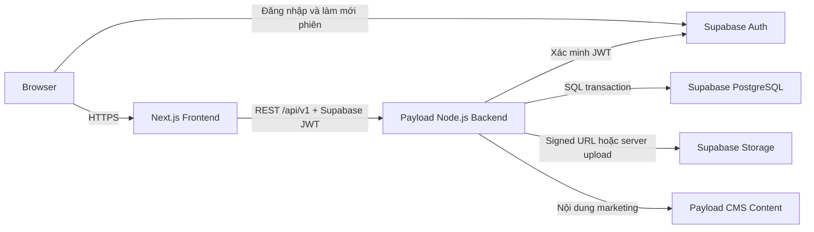

# Architecture Decisions

## 1. Trạng thái

Các quyết định trong file này ở trạng thái **Approved** cho MVP. Thay đổi kiến trúc phải đi qua Change Request.

## 2. Sơ đồ tổng thể

## 3. Ranh giới trách nhiệm

### Next.js frontend

- Hiển thị Storefront, Buyer, Seller Center và Admin Portal.
- Quản lý trạng thái giao diện và phiên Supabase phía trình duyệt.
- Gọi REST API của Payload; không chứa business rule quyết định cuối cùng.
- Có thể validate sớm để hỗ trợ UX nhưng không được coi client validation là biện pháp bảo vệ dữ liệu.
- Không được nhận database URL, service-role key hoặc Storage secret.

### Payload/Node.js backend

- Cung cấp API dưới `/api/v1`.
- Xác minh Supabase JWT, tải `User` nghiệp vụ và chặn tài khoản `LOCKED`.
- Thực thi RBAC, ownership, validation, transaction, idempotency và audit.
- Là điểm duy nhất ghi dữ liệu nghiệp vụ từ ứng dụng.
- Tổ chức module theo domain: `identity`, `catalog`, `cart`, `order`, `payment`, `voucher`, `review`, `notification`, `moderation`, `reporting`.
- Payload CMS content chỉ quản lý banner, campaign, FAQ và nội dung marketing; không chứa logic checkout/order/payment.

### Supabase Auth

- Là nguồn định danh duy nhất và quản lý mật khẩu, OAuth, access token, refresh token.
- Giá trị `sub` trong JWT ánh xạ trực tiếp tới `User.UserID`.
- Không tạo `AuthID` thứ hai và không lưu mật khẩu trong database nghiệp vụ.

### Supabase PostgreSQL

- Là nguồn dữ liệu chuẩn cho 22 bảng Schema Freeze v1.
- Enforce PK, FK, UNIQUE, CHECK và partial unique index có thể biểu diễn trực tiếp.
- Các thao tác nhiều bảng phải chạy trong transaction do backend điều phối.

### Supabase Storage

- Lưu avatar, logo Shop, ảnh Product và Review.
- Database chỉ lưu URL hoặc metadata.
- Upload/download riêng tư phải qua backend hoặc signed URL thời hạn ngắn.

## 4. Luồng request chuẩn

1. Browser đăng nhập qua Supabase Auth và nhận access token.
2. Next.js gửi `Authorization: Bearer <token>` tới Payload.
3. Payload xác minh chữ ký, issuer, audience và thời hạn token.
4. Payload lấy `sub`, tải `User` và kiểm tra `Status = ACTIVE`.
5. Middleware dựng `RequestContext` gồm `request_id`, `user_id`, `role` và `shop_id` nếu có.
6. Controller parse request; service thực thi rule và transaction; repository truy cập database.
7. Payload trả envelope chuẩn và ghi structured log.

## 5. Quy tắc module và dependency

- Controller chỉ xử lý HTTP; không chứa SQL hoặc business rule nhiều bước.
- Service sở hữu use case, authorization theo ownership và transaction boundary.
- Repository chỉ truy cập dữ liệu; không tự quyết định quyền người dùng.
- Domain module không đọc trực tiếp bảng của module khác ngoài repository/service contract đã công bố.
- `order` có thể phụ thuộc `catalog`, `voucher`, `payment`, `notification`; chiều ngược lại không được phụ thuộc `order` để tránh vòng lặp.
- Reporting chỉ đọc dữ liệu nguồn; không tạo bảng tổng hợp thứ hai trong MVP.

## 6. Quyết định dữ liệu

- Tên trong spec là tên logic; tên vật lý theo [`db-schema-rules.md`](db-schema-rules.md).
- Tiền dùng `NUMERIC(15,2)` trong PostgreSQL và decimal string trên JSON.
- Thời gian lưu `TIMESTAMPTZ`, trả ISO 8601 UTC.
- Các snapshot Order/OrderItem và trường tài chính là bất biến sau khi tạo.
- Không dùng trigger để liên tục tính lại tiền Order; trigger chỉ được dùng khi có lý do độc lập và CR phê duyệt.

## 7. Quyết định ngoài phạm vi MVP

- Không split payment, partial payment hoặc trả góp.
- Không nhiều voucher trên một Order.
- Không một Order chứa nhiều Shop.
- Không nhiều Shipment trên một Order.
- Không chat realtime, hoàn tiền nâng cao, ví thật, livestream hoặc gợi ý AI.

