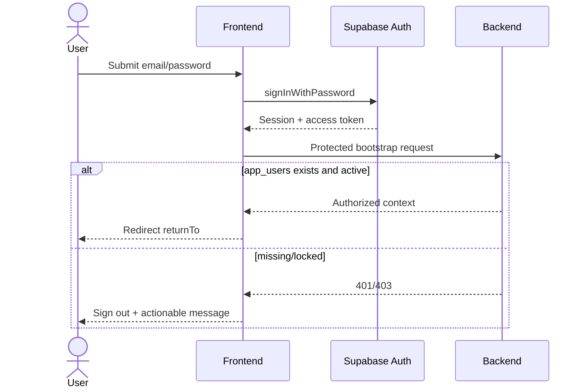
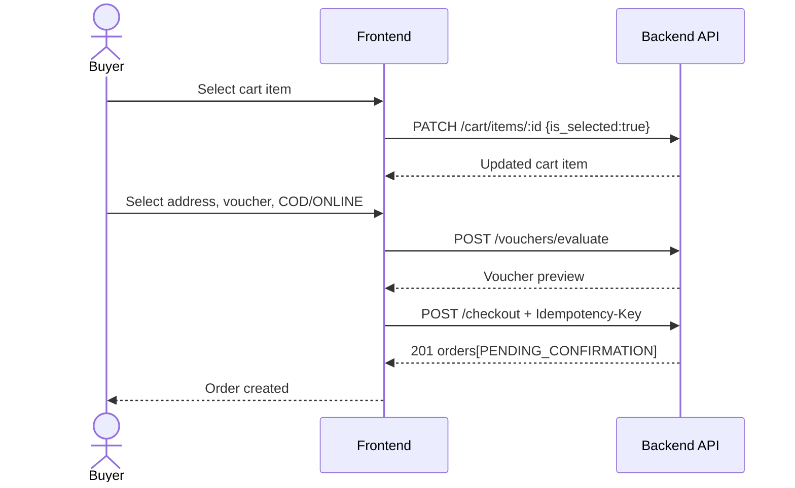
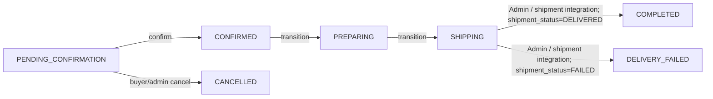

# 02. Pages và user flows

> **Phiên bản:** 1.1.0  
> **Trạng thái:** IMPLEMENTATION-READY WITH DECLARED BLOCKERS

## 1. Route map

Các route dưới đây là route sản phẩm dự kiến. Đối chiếu source hiện tại trong `frontend/src/app`: đã có `/`, `/products`, `/products/[id]`, `/cart`, `/checkout`, `/orders`, `/notifications`, `/profile`, `/login`, `/register`, `/seller`, `/seller/orders`, `/seller/products`. Chưa có `/orders/[id]/review`, `/seller/products/new`, `/admin` hoặc `/admin/categories`; các route đó cần được tạo trước khi QA theo flow tương ứng.

| Route | Role | Data readiness | Strategy |
|---|---|---|---|
| `/` | Public | `PARTIAL` | API catalog + static category config |
| `/products/[id]` | Public | `PARTIAL` | API detail + placeholders; reviews hidden/flagged |
| `/cart` | Buyer | `PARTIAL` | API identity/selection + blocker cho joined display data |
| `/checkout` | Buyer | `AVAILABLE` sau cart selection | API thật; không QR |
| `/orders` | Buyer | `STUB` (GET 200 rỗng/placeholder) | Route FE đã có; mock repository cho tới khi order query được wire |
| `/orders/[id]/review` | Buyer | `NOT_IMPLEMENTED` (BE 501) | FE route chưa có; UI/mock; disable production submit |
| `/notifications` | Buyer | `NOT_IMPLEMENTED` (BE 501) | Route FE đã có; UI/mock; không hứa realtime |
| `/profile` | Authenticated | `MISSING` | Supabase metadata read-only hoặc mock |
| `/login` | Public-only | `PARTIAL` | Supabase login; cần cấu hình SDK/env |
| `/register` | Public-only | `BLOCKED` | cần app user/seller onboarding |
| `/seller` | Seller | `RUNTIME_BLOCKED/PARTIAL` | order table mock; stock mutation thật |
| `/seller/products/new` | Seller | `PARTIAL` | FE route chưa có; BE create có, category/media thiếu |
| `/admin` | Admin | `PARTIAL` | FE route chưa có; lock/unlock BE có, lists dùng mock |
| `/admin/categories` | Admin | `MISSING` | FE route và category HTTP API chưa có; mock/local-only |

## 2. Quy tắc chung cho page

Mỗi route tải dữ liệu phải có:

- `loading.tsx` hoặc skeleton cục bộ.
- Empty state có CTA phù hợp.
- Error state có retry và hiển thị `request_id` khi có.
- Unauthorized redirect giữ `returnTo` nội bộ an toàn.
- Mutation có pending/disabled state, chống double submit.
- Feature phụ thuộc mock phải hiển thị dev badge trong non-production và bị feature-flag ở production.

## 3. Chi tiết 14 màn hình

### 3.1. Trang chủ `/`

**Mục tiêu:** khám phá và tìm sản phẩm.

**UI:** header/search, hero tĩnh, category filter, product grid, pagination/load more, mobile dock.

**API:** `GET /products?search=&category_id=&sort=&cursor=&limit=`.

**Lưu ý:** category API chưa có; chỉ bật filter tĩnh khi có category UUID lấy từ seed/DB thật của đúng môi trường. Không tự sinh hoặc tự đặt UUID (category_id được lọc trực tiếp trong DB nên UUID giả sẽ luôn cho danh sách rỗng); nếu chưa có fixture xác thực thì ẩn filter. Không hiển thị rating/sold count giả. Add-to-cart nhanh chỉ bật khi item có thể chọn variant; nếu nhiều variant thì đi tới detail.

**Acceptance:** search debounce; URL giữ filter; load more không trùng item; empty/error/retry đầy đủ.

### 3.2. Chi tiết sản phẩm `/products/[id]`

**UI:** tên/mô tả, variant selector, price/stock, quantity, add-to-cart, ảnh placeholder, review placeholder.

**API:** `GET /products/:id`, `POST /cart/items`.

**Behavior:** `stock_quantity=0` vô hiệu CTA. Guest bấm add-to-cart được chuyển login với `returnTo`. “Mua ngay” phải add item rồi set `is_selected=true` trước khi sang checkout.

**Blocker:** API detail chưa có images/shop metadata/reviews. Ẩn “Chat ngay” và “Xem shop” nếu chưa có route.

### 3.3. Giỏ hàng `/cart`

**UI:** item list, quantity, checkbox, delete, summary.

**API:** `GET /cart`, `PATCH /cart/items/:id`, `DELETE /cart/items/:id`.

**Selection:** checkbox gọi `PATCH { is_selected }`; quantity gọi `PATCH { quantity }`. Checkout chỉ bật khi có ít nhất một item selected.

**Blocker:** runtime cart chưa trả product name/image/price/stock/shop. Không thể hoàn thiện UI production chỉ với response hiện tại. Dùng `CartRepository` interface để mock trong lúc chờ enriched cart response.

### 3.4. Checkout `/checkout`

**Precondition:** Buyer authenticated, có address và cart item `is_selected=true`.

**UI:** address selector, selected items summary, voucher per shop, payment `COD | ONLINE`, phí vận chuyển `0₫` (backend hiện hardcode `shipping_fee=0.00`), total do server xác nhận, submit. Không cộng phí ship mock `25.000₫` hoặc cho client tự truyền phí ship.

**API:** `GET /addresses`, `GET /vouchers/applicable`, `POST /vouchers/evaluate`, `POST /checkout`.

**Submit:** tạo và giữ một UUID làm `Idempotency-Key` gắn với snapshot request; cùng request retry sau timeout/mất mạng phải dùng lại key. Nếu đổi địa chỉ, phương thức thanh toán hoặc voucher thì tạo key mới. Nếu kết quả lần gửi trước chưa rõ, retry snapshot/key cũ để tránh tạo đơn trùng trước khi cho sửa intent. Body chỉ gồm `address_id`, `payment_method`, `vouchers`.

**Success:** chuyển `/orders?created=<ids>` hoặc success screen. Không gọi payment retry ngay sau checkout; không hiển thị QR khi backend chưa có provider session.

### 3.5. Đơn hàng `/orders`

**UI:** tabs theo `OrderStatus`, order card, cancel dialog, empty/error.

**API mục tiêu:** `GET /orders`, `GET /orders/:id`, `POST /orders/:id/cancel`.

**Runtime:** list/detail bị blocked. Trong development dùng mock repository cùng DTO mục tiêu; production feature flag tắt cho tới khi integration test backend pass.

**Cancel:** luôn hỏi reason; sau success refetch list. Chỉ hiển thị nút khi status `PENDING_CONFIRMATION`.

### 3.6. Đánh giá `/orders/[id]/review`

**UI:** danh sách order item chưa review, rating 1–5, content, image attachment preview.

**API mục tiêu:** `POST /order-items/:order_item_id/review`.

**Blocker:** runtime review service chưa wire; media upload contract chưa có. Có thể triển khai form và validation bằng mock, nhưng production submit phải tắt.

### 3.7. Thông báo `/notifications`

**UI:** filter type/read state, list, mark-one-read.

**API mục tiêu:** `GET /notifications?is_read=`, `PATCH /notifications/:id/read`.

**Blocker:** runtime trả 501. Không ghi “realtime”; contract hiện là request/response. Nút “đánh dấu tất cả đã đọc” ẩn cho tới khi có bulk endpoint hoặc thực hiện từng item với giới hạn rõ ràng.

### 3.8. Hồ sơ `/profile`

**UI:** avatar, full name, phone, email read-only, address shortcut.

**Data:** ưu tiên `/profile` khi backend bổ sung. Tạm thời chỉ đọc email/metadata từ Supabase; không coi metadata là nguồn nghiệp vụ chính.

**Blocker:** chưa có profile API và media upload. Save production bị tắt cho tới khi có contract.

### 3.9. Đăng nhập `/login`

**UI:** email, password, show password, forgot-password link chỉ bật nếu flow đã cấu hình.

**Flow:** Supabase `signInWithPassword` → lấy session → gọi một protected lightweight request hoặc session bootstrap để xác nhận `app_users` tồn tại → redirect `returnTo` an toàn.

**Errors:** không tiết lộ email tồn tại hay không; xử lý locked/internal-user-missing riêng.

### 3.10. Đăng ký `/register`

**UI mục tiêu:** email, password, confirm password, full name, account type Buyer/Seller; seller fields chỉ xuất hiện khi onboarding đã được thiết kế.

**Blocker:** chưa có cách đáng tin cậy tạo `app_users`, profile và shop sau Supabase signup. Không phát hành flow production cho tới khi GAP-AUTH-ONBOARDING đóng.

### 3.11. Seller portal `/seller`

**UI:** order queue, product/stock table, KPI.

**Available:** `PATCH /product-variants/:id/stock`, order confirm/transition khi biết order ID.

**Blocked:** `GET /orders` runtime trả rỗng; `GET /products?shop_id` không được hỗ trợ; seller stats chưa có. Dùng mock repository để phát triển layout, không tự suy luận doanh thu từ dữ liệu thiếu.

### 3.12. Tạo sản phẩm `/seller/products/new`

**UI:** basic info, category, image URLs/upload placeholder, variant rows.

**API:** `POST /products` với `stock_quantity`, `variant_name`, `variant_value`, `sort_order`.

**Blockers:** category API và media upload chưa có. Development chỉ dùng category config tĩnh với UUID xác thực từ DB/seed của môi trường; tuyệt đối không tự bịa UUID. Production cần category/media contract trước khi bật.

### 3.13. Admin `/admin`

**UI:** users, shops, products, logs tabs.

**Available:** lock/unlock user nếu đã biết user ID.

**Blocked:** chưa có list users/logs/shops/products; chưa có shop/product moderation routes. Dùng mock để xây UI; chỉ mutation user lock/unlock được bật sau khi danh sách thật tồn tại hoặc admin nhập ID qua internal-only tool.

### 3.14. Admin categories `/admin/categories`

**UI mục tiêu:** tree/table, create/edit, active toggle.

**Blocker:** không có category HTTP API. Toàn màn hình dùng mock/local adapter và không phát hành production.

## 4. User flows

### 4.1. Login

### 4.2. Buyer checkout

### 4.3. Seller fulfillment

Seller phải gọi `PREPARING` sau `CONFIRMED`, rồi mới gọi `SHIPPING` từ `PREPARING`. Seller không được chuyển sang `COMPLETED` hoặc `DELIVERY_FAILED`; UI Seller không hiển thị nút hoàn tất đơn. Order list runtime phải được wire trước khi flow này có thể chạy end-to-end từ UI.

### 4.4. Admin moderation

Admin list users → chọn user → nhập reason → `POST /admin/users/:id/lock|unlock` → refetch list → hiển thị audit result. Hiện bước list/refetch bị blocked, nên flow chỉ hoàn chỉnh sau GAP-ADMIN-READS.
