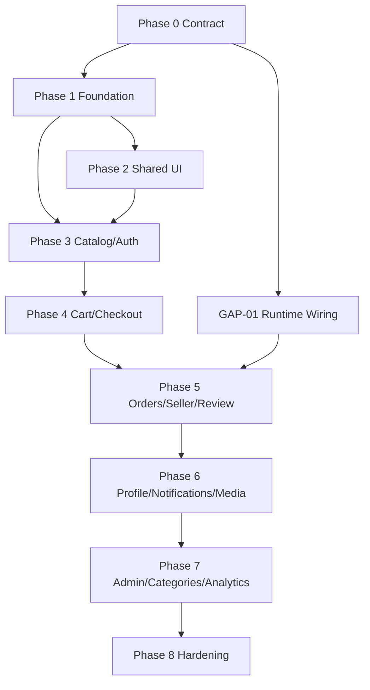

# 08. Implementation plan

> **Phiên bản:** 1.1.0  
> **Trạng thái:** READY TO EXECUTE

## 1. Chiến lược

Triển khai theo vertical slice nhưng không giả vờ các backend blocker đã sẵn sàng:

- Phase 0–2 có thể bắt đầu ngay.
- Product list/detail core có thể dùng API thật.
- Cart UI đầy đủ, order center, review, notifications, profile và admin dùng repository mock cho tới khi backend gap tương ứng đóng.
- Mock và API adapter phải cùng interface để thay implementation mà không sửa component.
- Không đưa feature mock vào production nếu feature flag chưa tắt.

## 2. Phase 0 — Contract freeze và guardrails

| ID | Owner | Task | Acceptance criteria |
|---|---|---|---|
| C-001 | FE+BE | Chấp thuận contract v1.1 này | checkout, cart selection, order states và money representation được xác nhận |
| C-002 | BE | Thêm runtime integration smoke test | test dùng `createRuntimeApp()`, không chỉ inject mock service |
| C-003 | FE | Tạo feature flag config | dev/prod defaults rõ ràng; production tắt feature blocked |
| C-004 | FE | Tạo repository interfaces và mock boundary | page không import mock literal trực tiếp |
| C-005 | FE+BE | Chốt onboarding/payment/media decisions | ghi ADR hoặc change request cho từng quyết định |

## 3. Phase 1 — FE foundation

| ID | Depends | Task | Acceptance criteria |
|---|---|---|---|
| F-101 | C-001 | Cài Supabase client và env validation | thiếu env fail với message rõ; token không log |
| F-102 | F-101 | API client | base URL, Bearer token, envelopes, 204, timeout, AppError, request_id |
| F-103 | F-102 | Endpoint modules | catalog/cart/address/voucher/checkout/order tách module |
| F-104 | F-103 | Endpoint-specific adapters | unit test decimal/null/unknown enum |
| F-105 | F-101 | Auth/session provider | refresh session, sign-out, safe returnTo |
| F-106 | F-105 | Route guards | public/buyer/seller/admin behavior; không thay backend auth |
| F-107 | C-003 | Mock/API repository switch | switch bằng dependency/config, không branch trong component |

## 4. Phase 2 — Shared UI và app shell

| ID | Depends | Task | Acceptance criteria |
|---|---|---|---|
| U-201 | — | Đồng bộ Tailwind tokens với CSS variables | không đổi visual ngoài ý muốn |
| U-202 | U-201 | Button/form controls | focus-visible, error, disabled, loading, ARIA |
| U-203 | U-201 | Dialog/toast | focus trap, ESC, return focus, live region |
| U-204 | U-201 | StatusBadge | đủ 7 order states, không chỉ dùng màu |
| U-205 | U-201 | Skeleton/Empty/Error | dùng lại được trên mọi data screen |
| U-206 | U-202 | Header/mobile dock | responsive, safe area, auth-aware navigation |

## 5. Phase 3 — Public catalog và auth

| ID | Depends | Task | Backend dependency | Acceptance criteria |
|---|---|---|---|---|
| B-301 | F-103,U-205 | Product list/search/sort/load-more | available | URL giữ filter; cursor không trùng |
| B-302 | F-104,U-202 | Product detail core | partial | variant price/stock đúng; unsupported section ẩn |
| B-303 | F-105 | Login | Supabase config | login, invalid credential, locked/missing app user handled |
| B-304 | F-107 | Registration UI | GAP-06 | mock only; production flag off |
| B-305 | F-107 | Category adapter | GAP-05 | static dev config/hidden production filter |

## 6. Phase 4 — Cart, address, voucher và checkout

| ID | Depends | Task | Backend dependency | Acceptance criteria |
|---|---|---|---|---|
| B-401 | B-302 | Add to cart | available | guest returnTo; server error displayed |
| B-402 | F-107,U-205 | Cart screen | GAP-03 for real data | mock/API implementations share interface |
| B-403 | B-402 | Quantity/selection/delete | available | optimistic rollback; is_selected persisted |
| B-404 | F-103 | Address list/create | available | validation + refetch |
| B-405 | B-404 | Address edit/default/delete UI | GAP-01 | mock/disabled in production |
| B-406 | B-402 | Voucher list/preview | available | per-shop preview, decimal-safe totals |
| B-407 | B-403,B-404,B-406 | Checkout | available | unique key per attempt; same key on safe retry; no QR promise |
| B-408 | B-407 | Checkout E2E | test DB | creates one order/shop, clears selected items, prevents duplicate |

## 7. Phase 5 — Orders, seller và review

| ID | Depends | Task | Backend dependency | Acceptance criteria |
|---|---|---|---|---|
| O-501 | C-002 | Wire order list/detail runtime | GAP-01 | buyer/seller/admin scoping integration tests pass |
| O-502 | O-501,F-107 | Buyer order center | order reads ready | filter, detail, empty/error |
| O-503 | O-502 | Cancel order | available | reason required; 409 refreshes state |
| O-504 | O-501 | Seller order table | order reads ready | only own shop orders |
| O-505 | O-504 | Confirm/transition | available | state machine actions only; invalid transition handled |
| O-506 | C-002 | Wire review runtime | GAP-01 | create review integration test |
| O-507 | O-502,O-506 | Review form | GAP-09 for images | text/rating works; images gated |
| O-508 | B-301 | Seller product list API | GAP-04 | owner-scoped pagination/filter |
| O-509 | O-508 | Seller stock edit | available | quantity payload; ownership errors handled |

## 8. Phase 6 — Profile, notifications và media

| ID | Depends | Task | Backend dependency | Acceptance criteria |
|---|---|---|---|---|
| P-601 | C-005 | Implement profile API | GAP-07 | GET/PATCH scoped to caller |
| P-602 | P-601 | Profile screen | profile API | email read-only; edit/refetch |
| P-603 | C-002 | Wire notification runtime | GAP-01 | list/detail/read integration tests |
| P-604 | P-603 | Notification center | REST ready | filters, optimistic read, no realtime claim |
| P-605 | P-603 | Bulk mark-read API/UI | GAP-10 | bounded, idempotent behavior |
| P-606 | C-005 | Media upload contract | GAP-09 | ownership, MIME/size/count, cleanup tested |
| P-607 | P-606 | Product/avatar/review uploads | media API | progress, retry, remove, accessible preview |

## 9. Phase 7 — Admin, categories và seller analytics

| ID | Depends | Task | Backend dependency | Acceptance criteria |
|---|---|---|---|---|
| A-701 | C-005 | Category public/admin APIs | GAP-05 | tree/list/create/update/status tests |
| A-702 | A-701 | Homepage/seller/admin category UI | category APIs | bỏ static config |
| A-703 | C-005 | Admin read APIs | GAP-08 | cursor/filter users/logs/shops/products |
| A-704 | A-703 | Admin dashboard | admin reads | tables, filters, empty/error |
| A-705 | A-703 | User lock/unlock | available | reason, audit, refetch |
| A-706 | A-703 | Shop/product moderation routes | GAP-08 | ownership/audit/status semantics tested |
| A-707 | O-501 | Seller stats API | GAP-12 | date range/timezone/revenue definition documented |
| A-708 | A-707 | Seller KPI UI | stats API | no client-side financial approximation |

## 10. Phase 8 — Hardening và release

| ID | Depends | Task | Acceptance criteria |
|---|---|---|---|
| Q-801 | Phase 1–7 | Typecheck/lint/build | pass sạch |
| Q-802 | Phase 1–7 | Accessibility audit | keyboard, focus, labels, contrast, reduced motion |
| Q-803 | Phase 1–7 | Responsive/browser QA | 360px+, Chrome/Edge; no covered content |
| Q-804 | B-408,O-505 | Buyer/Seller E2E | critical paths pass against runtime backend |
| Q-805 | A-705 | RBAC/security test | direct URL/API access không bypass role/ownership |
| Q-806 | F-102 | Resilience test | 401/403/409/422/429/503/timeout behavior đúng |
| Q-807 | C-002 | Contract drift CI | runtime/OpenAPI/spec fixtures không lệch |
| Q-808 | all | Remove release mocks | production flags off hoặc backend ready; không có fake metric |

## 11. Dependency graph

## 12. Definition of Done theo ticket

Mỗi ticket FE phải ghi:

- source endpoint hoặc mock repository;
- request/response types và adapter;
- loading/empty/error/unauthorized states;
- cache invalidation sau mutation;
- responsive và keyboard behavior;
- unit/integration/E2E coverage phù hợp;
- feature flag và điều kiện bỏ flag nếu backend chưa ready.

Không đóng ticket chỉ vì giao diện giống mock trong khi API contract hoặc error path chưa được kiểm chứng.
