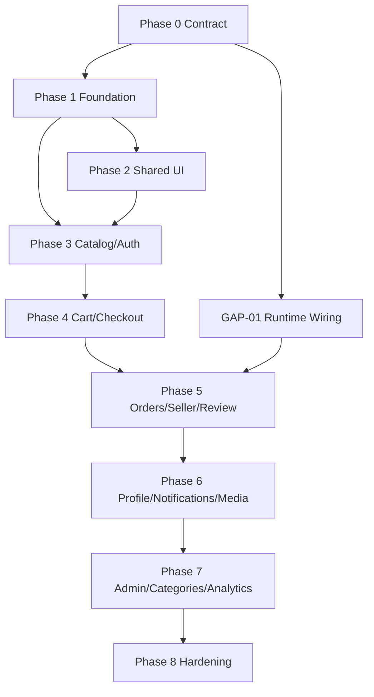

# 08. Implementation plan

> **Phiên bản:** 1.1.0  
> **Trạng thái:** READY TO EXECUTE

## 1. Chiến lược

Triển khai theo vertical slice nhưng không giả vờ các backend blocker đã sẵn sàng:

- Phase 0–2 có thể bắt đầu ngay.
- Product list/detail core có thể dùng API thật.
- Cart UI đầy đủ, order center, review, notifications, profile và admin dùng repository mock cho tới khi backend gap tương ứng đóng.
- Mock và API adapter phải cùng interface để thay implementation mà không sửa component.
- Không đưa feature mock vào production nếu feature flag chưa tắt.

### Ponytail skills theo phase

Ponytail đang để chế độ gọi thủ công, không tự chạy. Chỉ áp dụng skill khi người làm FE chủ động tag skill trong Codex; nếu không tag thì làm theo workflow và acceptance criteria bình thường. `@ponytail` hỗ trợ giữ phạm vi triển khai tối thiểu, còn `@ponytail-review` chỉ soi độ phức tạp/overengineering — không thay thế test, review tính đúng đắn, bảo mật hay accessibility.

| Phase | Skill gợi ý khi chủ động gọi | Phạm vi |
|---|---|---|
| 0 — Contract freeze | Không cần skill | Chốt contract/decision với FE-BE; không dùng skill để thay xác nhận nghiệp vụ. |
| 1 — FE foundation | `@ponytail`, `@ponytail-review` | Giữ API client/auth/repository vừa đủ; review diff sau khi hoàn tất foundation. |
| 2 — Shared UI/app shell | `@ponytail`, `@ponytail-review` | Tránh abstraction UI thừa; vẫn giữ đầy đủ accessibility và trạng thái component. |
| 3 — Catalog/auth | `@ponytail`, `@ponytail-review` | Áp dụng theo vertical slice/ticket; review phần vừa làm trước khi đóng phase. |
| 4 — Cart/checkout | `@ponytail`, `@ponytail-review` | Không giản lược contract, decimal-safe money, idempotency hoặc xử lý lỗi để giảm code. |
| 5 — Orders/seller/review | `@ponytail`, `@ponytail-review` | Không giản lược state machine, ownership, reason bắt buộc hoặc RBAC. |
| 6 — Profile/notifications/media | `@ponytail`, `@ponytail-review` | Giữ implementation tối thiểu nhưng không bỏ kiểm tra quyền, upload constraints hay trạng thái lỗi. |
| 7 — Admin/categories/analytics | `@ponytail`, `@ponytail-review` | Tránh framework nội bộ không cần thiết; không bỏ audit/RBAC hoặc quy tắc số liệu. |
| 8 — Hardening/release | `@ponytail-review`; `@ponytail-audit` tùy chọn một lần; `@ponytail-debt` có điều kiện | Review độ phức tạp diff cuối; audit toàn repo một lần nếu cần. Chỉ chạy debt khi code có marker `ponytail:` cần tổng hợp. |

`@ponytail-gain` (xem benchmark) và `@ponytail-help` (tra cách dùng) là skill tiện ích theo nhu cầu, không phải bước/gate của phase nào. Dù có gọi skill nào, vẫn phải chạy kiểm tra và nghiệm thu riêng theo ticket.

## Phân công 5 người FE

Mỗi ticket có đúng một owner FE chịu trách nhiệm tích hợp và nghiệm thu. Nhiệm vụ backend trong cột dependency là đầu ra cần nhận từ BE, không tự nhận là phần FE đã hoàn tất. Năm người có thể bắt đầu cùng lúc bằng UI/mock adapter theo contract đã ghi trong file 04–07; chỉ nối API thật sau khi endpoint và test runtime đạt điều kiện sẵn sàng.

| Người | Phạm vi và file sở hữu chính | Ticket FE chính | Làm ngay, không chờ người khác | Điểm bàn giao / điều kiện nối thật |
|---|---|---|---|---|
| 1 — FE platform/integration | `src/lib/api`, `src/lib/auth`, `src/lib/config`, `src/lib/repositories` (shared), `/login`, `/register`, config/CI | C-001, C-003–005, F-101–107, B-303–304, Q-801, Q-806–808 | Chốt type/error parser, env/feature flags, repository interface, auth shell; dùng fake token/session trong test | Bàn giao API client, auth guard, mock/API switch và contract test cho 3/4/5. Chỉ bật auth thật khi Supabase/env được kiểm chứng. |
| 2 — UI/UX và account | `src/app/globals.css`, `src/app/layout.tsx`, `src/components/ui`, shared navigation, `/profile`, `/notifications` | D-001–004, U-201–206, P-602, P-604–605, P-607b, Q-802–803 | Khóa screen inventory, states, token/font/responsive rules; dựng component + shell với fixture | Bàn giao token, component API và shell cho 3/4/5. Profile/notification chỉ nối thật sau P-601/P-603 và contract test; P-605 chờ GAP-10. |
| 3 — Catalog/seller catalog | `/`, `/products/[id]`, `/seller/products/new`, feature catalog/seller product/category/media | B-301–302, B-305, B-401, O-508–509, P-607a, A-700/A-702 | Làm list/detail với API catalog sẵn có; dựng seller form và category view bằng adapter/mock đúng trạng thái readiness | Bàn giao selection/add-to-cart UI contract cho 4. O-508 chờ GAP-04; category API chờ A-701/GAP-05; upload chờ P-606/GAP-09. |
| 4 — Buyer cart/checkout | `/cart`, `/checkout`, feature cart/address/voucher/checkout | B-402–408, Q-804 | Dựng cart và checkout states/form bằng repository mock; viết contract fixture, money/idempotency cases | Nhận API client từ 1 và add-to-cart contract từ 3; cart full data chờ GAP-03. B-408 chạy với backend/test DB thật. |
| 5 — Orders/review/admin | `/orders`, `/orders/[id]/review`, `/seller` (order/dashboard), `/admin`, `/admin/categories`, feature orders/review/admin/stats | O-502–505, O-507, P-607c, A-704–705, A-708–709, Q-805 | Dựng order timeline, seller transition, review/admin states bằng mock adapter; viết transition/RBAC cases | Order read chờ O-501/GAP-01; review submit chờ O-506; admin reads chờ A-703/GAP-08; seller KPI chờ A-707/GAP-12. |

`D-*` là đầu ra thiết kế cần chốt trước khi biến prototype thành màn hình mới:

| ID | Owner | Task | Acceptance criteria |
|---|---|---|---|
| D-001 | Người 2 | Screen inventory và luồng Buyer/Seller/Admin dựa trên file 02; đối chiếu `sodoUI.md` như tài liệu tham khảo | đủ route, role, navigation, loading/empty/error/unauthorized và mobile/desktop state; mỗi màn hình có owner, chỗ lệch sitemap được ghi rõ |
| D-002 | Người 2 | Khóa [UI/UX rules](./09-ui-ux-rules.md) và component contract | token/font/breakpoint/CTA contrast được kiểm tra; người 3/4/5 xác nhận handoff |
| D-003 | Người 2 | UX handoff cho 3/4/5 | mỗi vertical slice có bố cục/interaction/state checklist; link hoặc mô tả wireframe trong ticket, không lấy prototype làm contract |
| D-004 | Người 2 | Sau U-201 và các page mẫu, soát trang chủ, checkout, seller order, admin dashboard ở 360/1280px | thống nhất hierarchy/spacing/CTA/ảnh/trạng thái và contrast trước khi nhân rộng style; Người 3/4/5 cung cấp page mẫu, không phải chờ để viết fixture/mock |

### Ranh giới file và cách bàn giao

- Người 1 duy nhất sửa `package.json`, lockfile, env example, config chung, API client, auth và shared repository interface. Người khác đề xuất thay đổi kèm ví dụ payload/test; Người 1 cập nhật seam dùng chung.
- Người 2 duy nhất sửa token/global CSS, layout, shared UI components và navigation. Người 3/4/5 sở hữu page/feature của mình; cần thay đổi component chung thì mở yêu cầu cho Người 2. Tránh hai người sửa cùng một page.
- Người 3 sở hữu nút add-to-cart ở product detail; Người 4 sở hữu cart command/repository. Hai người khóa input/output của action trước khi nối. Product media P-607a thuộc Người 3; avatar UI P-607b thuộc Người 2; review media UI P-607c thuộc Người 5, đều chờ media contract P-606.
- `/seller` và `/admin/categories` do Người 5 sở hữu page; Người 3 bàn giao category adapter A-700 qua export riêng, không sửa trực tiếp page của Người 5. `A-702` chỉ đổi category UI trên các page thuộc Người 3; `A-709` là admin categories UI của Người 5. Hai UI task chạy song song sau A-700.
- Mỗi người làm trên nhánh riêng `codex/fe-nguoi-N-<ticket>` hoặc tên nhánh nhóm thống nhất; PR giới hạn file thuộc owner. Review chéo tối thiểu: Người 1 kiểm API/auth/contract, Người 2 kiểm UI/accessibility, owner consumer kiểm payload/hành vi. PR chạm file chung phải có owner file duyệt.
- Một handoff chỉ coi là xong khi có type/interface, ví dụ fixture request/response/error, test liên quan và đường dẫn PR/commit ghi trong [progress FE](./progress/README.md). Dependency chưa tới thì làm phần UI/mock/test độc lập; ghi rõ blocker, owner cung cấp và điều kiện nghiệm thu trong progress, không tự tạo API field/UUID giả làm dữ liệu thật.

## Bắt đầu ngay

Chạy Backend tại cổng `3001` và Next.js tại `3000` (CORS dev đã cho phép hai origin localhost mặc định). Sao chép `ecommerce-web/.env.example` thành `.env.local`, điền URL và publishable key của Supabase; không đưa secret/service-role key vào biến `NEXT_PUBLIC_*`. Khởi động từ thư mục `ecommerce-web` bằng `npm install` rồi `npm run dev`. Contract OpenAPI có ở `http://localhost:3001/api/v1/openapi.json`.

Thứ tự tích hợp: Người 1 làm F-102 API client + test parser/envelope/204 → F-103/F-104 adapters; Người 2 làm D-001–003 và Phase 2 song song; Người 3/4/5 làm UI states, fixture và mock repository trong phạm vi riêng ngay từ đầu. D-004 là lượt soát visual sau khi có các page mẫu, trước khi nhân rộng style. Catalog public B-301/B-302 có thể nối API sau F-102. Cart/address/voucher/checkout chỉ nối sau contract tests; order center, review, notifications, profile, category/admin reads vẫn dùng mock interface cho đến khi gap đóng. Màn hình giao diện hiện tại là prototype, không phải nguồn dữ liệu hay hành vi nghiệp vụ.

## 2. Phase 0 — Contract freeze và guardrails

**Ponytail:** Không cần skill; ưu tiên xác nhận contract và quyết định FE-BE.

**Làm song song:** Người 1 C-001/C-003–005; Người 2 D-001–003; Người 3/4/5 lập fixture và checklist state cho các route mình sở hữu. C-002 do BE thực hiện; FE theo dõi kết quả.

| ID | Owner | Task | Acceptance criteria |
|---|---|---|---|
| C-001 | FE+BE | Chấp thuận contract v1.1 này | checkout, cart selection, order states và money representation được xác nhận; không chặn foundation |
| C-002 | BE | Thêm runtime integration smoke test | test dùng `createRuntimeApp()`, không chỉ inject mock service |
| C-003 | FE | Tạo feature flag config | dev/prod defaults rõ ràng; production tắt feature blocked |
| C-004 | FE | Tạo repository interfaces và mock boundary | page không import mock literal trực tiếp |
| C-005 | FE+BE | Chốt onboarding/payment/media decisions | ghi ADR hoặc change request cho từng quyết định |

## 3. Phase 1 — FE foundation

**Ponytail:** `@ponytail` khi triển khai; `@ponytail-review` khi rà diff của phase.

**Owner:** Người 1. Người 3/4/5 tiêu thụ type và mock repository sau khi F-102/F-107 bàn giao; không cùng sửa API client.

| ID | Depends | Task | Acceptance criteria |
|---|---|---|---|
| F-101 | C-001 | Cài Supabase client và env validation | thiếu env fail với message rõ; token không log |
| F-102 | F-101 | API client | base URL, Bearer token, envelopes, 204, timeout, AppError, request_id |
| F-103 | F-102 | Endpoint modules | catalog/cart/address/voucher/checkout/order tách module |
| F-104 | F-103 | Endpoint-specific adapters | unit test decimal/null/unknown enum |
| F-105 | F-101 | Auth/session provider | refresh session, sign-out, safe returnTo |
| F-106 | F-105 | Route guards | public/buyer/seller/admin behavior; không thay backend auth |
| F-107 | C-003 | Mock/API repository switch | switch bằng dependency/config, không branch trong component |

## 4. Phase 2 — Shared UI và app shell

**Ponytail:** `@ponytail` khi triển khai; `@ponytail-review` khi rà diff của phase.

**Owner:** Người 2. D-002 và [UI/UX rules](./09-ui-ux-rules.md) là đầu vào của U-201; component được bàn giao theo prop/state contract cho 3/4/5.

| ID | Depends | Task | Acceptance criteria |
|---|---|---|---|
| U-201 | — | Đồng bộ Tailwind tokens với CSS variables | không đổi visual ngoài ý muốn |
| U-202 | U-201 | Button/form controls | focus-visible, error, disabled, loading, ARIA |
| U-203 | U-201 | Dialog/toast | focus trap, ESC, return focus, live region |
| U-204 | U-201 | StatusBadge | đủ 7 order states, không chỉ dùng màu |
| U-205 | U-201 | Skeleton/Empty/Error | dùng lại được trên mọi data screen |
| U-206 | U-202 | Header/mobile dock | responsive, safe area, auth-aware navigation |

## 5. Phase 3 — Public catalog và auth

**Ponytail:** `@ponytail` theo ticket; `@ponytail-review` khi rà diff trước khi đóng phase.

**Owner:** Người 3 nhận B-301/B-302/B-305; Người 1 nhận B-303/B-304. Người 3 chỉ dùng category UUID có thật hoặc ẩn filter.

| ID | Depends | Task | Backend dependency | Acceptance criteria |
|---|---|---|---|---|
| B-301 | F-103,U-205 | Product list/search/sort/load-more | available | URL giữ filter; cursor không trùng |
| B-302 | F-104,U-202 | Product detail core | partial | variant price/stock đúng; unsupported section ẩn |
| B-303 | F-105 | Login | Supabase config | login, invalid credential, locked/missing app user handled |
| B-304 | F-107 | Registration UI | GAP-06 | mock only; production flag off |
| B-305 | F-107 | Category adapter | GAP-05 | static dev config chỉ dùng UUID xác minh từ seed/DB của đúng môi trường; nếu thiếu thì ẩn filter; không tự tạo UUID |

## 6. Phase 4 — Cart, address, voucher và checkout

**Ponytail:** `@ponytail` theo ticket; `@ponytail-review` khi rà diff. Không giản lược các invariant checkout nêu trong acceptance criteria.

**Owner:** Người 4 nhận B-402–408; Người 3 nhận B-401 trong product detail và bàn giao cart command cho Người 4.

| ID | Depends | Task | Backend dependency | Acceptance criteria |
|---|---|---|---|---|
| B-401 | B-302 | Add to cart | available | guest returnTo; server error displayed |
| B-402 | F-107,U-205 | Cart screen | GAP-03 for real data | mock/API implementations share interface |
| B-403 | B-402 | Quantity/selection/delete | available | optimistic rollback; is_selected persisted |
| B-404 | F-103 | Address list/create | available | validation + refetch |
| B-405 | B-404 | Address edit/default/delete UI | GAP-01 | mock/disabled in production |
| B-406 | B-402 | Voucher list/preview | available | per-shop preview, decimal-safe totals |
| B-407 | B-403,B-404,B-406 | Checkout | available | phí ship hiển thị 0; key gắn snapshot; retry cùng payload dùng key cũ, đổi payload dùng key mới; resolve request mơ hồ trước intent mới |
| B-408 | B-407 | Checkout E2E | test DB | creates one order/shop, clears selected items, prevents duplicate |

## 7. Phase 5 — Orders, seller và review

**Ponytail:** `@ponytail` theo ticket; `@ponytail-review` khi rà diff. Skill không thay việc kiểm tra quyền và chuyển trạng thái hợp lệ.

**Owner:** Người 5 nhận O-502–505/O-507; Người 3 nhận O-508–509. O-501/O-506 là runtime wiring phía BE; Người 5 theo dõi readiness rồi mới nối thật.

| ID | Depends | Task | Backend dependency | Acceptance criteria |
|---|---|---|---|---|
| O-501 | C-002 | Wire order list/detail runtime | GAP-01 | buyer/seller/admin scoping integration tests pass |
| O-502 | O-501,F-107 | Buyer order center | order reads ready | filter, detail, empty/error |
| O-503 | O-502 | Cancel order | available | reason required; 409 refreshes state |
| O-504 | O-501 | Seller order table | order reads ready | only own shop orders |
| O-505 | O-504 | Confirm/transition | available | tuần tự `PENDING_CONFIRMATION → CONFIRMED → PREPARING → SHIPPING`; Seller không được hoàn tất; xử lý 403/409 |
| O-506 | C-002 | Wire review runtime | GAP-01 | create review integration test |
| O-507 | O-502,O-506 | Review form | GAP-09 for images | text/rating works; images gated |
| O-508 | B-301 | Seller product list API | GAP-04 | owner-scoped pagination/filter |
| O-509 | O-508 | Seller stock edit | available | quantity payload; ownership errors handled |

## 8. Phase 6 — Profile, notifications và media

**Ponytail:** `@ponytail` theo ticket; `@ponytail-review` khi rà diff.

**Owner:** Người 2 nhận P-602/P-604–605 và avatar UI; Người 3 nhận product media; Người 5 nhận review media. P-601/P-603/P-606 là dependency BE cần xác nhận trước khi nối thật.

| ID | Depends | Task | Backend dependency | Acceptance criteria |
|---|---|---|---|---|
| P-601 | C-005 | Implement profile API | GAP-07 | GET/PATCH scoped to caller |
| P-602 | P-601 | Profile screen | profile API | email read-only; edit/refetch |
| P-603 | C-002 | Wire notification runtime | GAP-01 | list/detail/read integration tests |
| P-604 | P-603 | Notification center | REST ready | filters, optimistic read, no realtime claim |
| P-605 | P-603 | Bulk mark-read API/UI | GAP-10 | bounded, idempotent behavior |
| P-606 | C-005 | Media upload contract | GAP-09 | ownership, MIME/size/count, cleanup tested |
| P-607a | P-606 | Product upload UI (Người 3) | media API | progress, retry, remove, accessible preview |
| P-607b | P-606 | Avatar upload UI (Người 2) | media API | progress, retry, remove, accessible preview |
| P-607c | P-606,O-507 | Review image upload UI (Người 5) | media API | progress, retry, remove, accessible preview |

## 9. Phase 7 — Admin, categories và seller analytics

**Ponytail:** `@ponytail` theo ticket; `@ponytail-review` khi rà diff. Không bỏ qua RBAC, audit hoặc định nghĩa số liệu.

**Owner:** Người 3 nhận A-700 category adapter và A-702 homepage/seller catalog; Người 5 nhận A-709 admin categories/dashboard, A-704/A-705/A-708. A-701/A-703/A-706/A-707 là dependency BE; chỉ nối khi contract/runtime sẵn sàng.

| ID | Depends | Task | Backend dependency | Acceptance criteria |
|---|---|---|---|---|
| A-700 | F-107 | Category repository/adapter interface (Người 3) | GAP-05 | mock/API cùng interface, fixture và UUID có thật hoặc ẩn filter; bàn giao sớm cho Người 5 |
| A-701 | C-005 | Category public/admin APIs | GAP-05 | tree/list/create/update/status tests |
| A-702 | A-700,A-701 | Homepage/seller catalog category UI (Người 3) | category APIs | bỏ static config sau API ready |
| A-703 | C-005 | Admin read APIs | GAP-08 | cursor/filter users/logs/shops/products |
| A-704 | A-703 | Admin dashboard | admin reads | tables, filters, empty/error |
| A-705 | A-703 | User lock/unlock | available | reason, audit, refetch |
| A-706 | A-703 | Shop/product moderation routes | GAP-08 | ownership/audit/status semantics tested |
| A-707 | O-501 | Seller stats API | GAP-12 | date range/timezone/revenue definition documented |
| A-708 | A-707 | Seller KPI UI | stats API | no client-side financial approximation |
| A-709 | A-700,A-701 | Admin categories UI (Người 5) | category APIs | CRUD/status theo quyền; dùng adapter đã bàn giao |

## 10. Phase 8 — Hardening và release

**Ponytail:** `@ponytail-review` cho diff cuối; tùy chọn `@ponytail-audit` một lần cho toàn repo. Dùng `@ponytail-debt` chỉ khi có marker `ponytail:` cần thu gom; đây không thay thế các gate QA bên dưới.

**Owner gate:** Người 1 Q-801/Q-806–808; Người 2 Q-802/Q-803; Người 4 Q-804; Người 5 Q-805. Mỗi owner feature cung cấp evidence/test cho gate và sửa lỗi trong phạm vi mình.

| ID | Depends | Task | Acceptance criteria |
|---|---|---|---|
| Q-801 | Phase 1–7 | Typecheck/lint/build | pass sạch |
| Q-802 | Phase 1–7 | Accessibility audit | keyboard, focus, labels, contrast, reduced motion |
| Q-803 | Phase 1–7 | Responsive/browser QA | 360px+, Chrome/Edge; no covered content |
| Q-804 | B-408,O-505 | Buyer/Seller E2E | critical paths pass against runtime backend |
| Q-805 | A-705 | RBAC/security test | direct URL/API access không bypass role/ownership |
| Q-806 | F-102 | Resilience test | 401/403/409/422/429/503/timeout behavior đúng |
| Q-807 | C-002 | Contract drift CI | runtime/OpenAPI/spec fixtures không lệch |
| Q-808 | all | Remove release mocks | production flags off hoặc backend ready; không có fake metric |

## 11. Dependency graph

## 12. Definition of Done theo ticket

Mỗi ticket FE phải ghi:

- source endpoint hoặc mock repository;
- request/response types và adapter;
- loading/empty/error/unauthorized states;
- cache invalidation sau mutation;
- responsive và keyboard behavior;
- unit/integration/E2E coverage phù hợp;
- feature flag và điều kiện bỏ flag nếu backend chưa ready.

Không đóng ticket chỉ vì giao diện giống mock trong khi API contract hoặc error path chưa được kiểm chứng.
