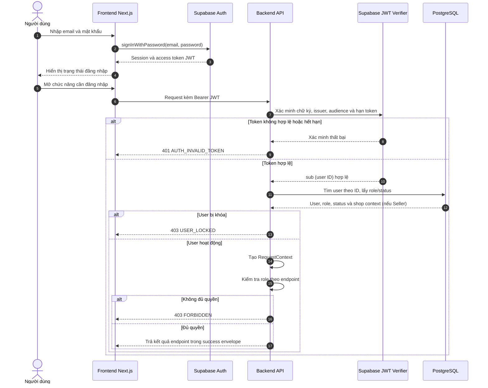

# UC01 — Đăng nhập và phân quyền

```mermaid
sequenceDiagram
    autonumber
    actor User as Người dùng
    participant FE as Frontend Next.js
    participant SA as Supabase Auth
    participant API as Backend API
    participant JWT as Supabase JWT Verifier
    participant DB as PostgreSQL

    User->>FE: Nhập email và mật khẩu
    FE->>SA: signInWithPassword(email, password)
    SA-->>FE: Session và access token JWT
    FE-->>User: Hiển thị trạng thái đăng nhập

    User->>FE: Mở chức năng cần đăng nhập
    FE->>API: Request kèm Bearer JWT
    API->>JWT: Xác minh chữ ký, issuer, audience và hạn token
    alt Token không hợp lệ hoặc hết hạn
        JWT-->>API: Xác minh thất bại
        API-->>FE: 401 AUTH_INVALID_TOKEN
    else Token hợp lệ
        JWT-->>API: sub (user ID) hợp lệ
        API->>DB: Tìm user theo ID, lấy role/status
        DB-->>API: User, role, status và shop context (nếu Seller)
        alt User bị khóa
            API-->>FE: 403 USER_LOCKED
        else User hoạt động
            API->>API: Tạo RequestContext
            API->>API: Kiểm tra role theo endpoint
            alt Không đủ quyền
                API-->>FE: 403 FORBIDDEN
            else Đủ quyền
                API-->>FE: Trả kết quả endpoint trong success envelope
            end
        end
    end
```
