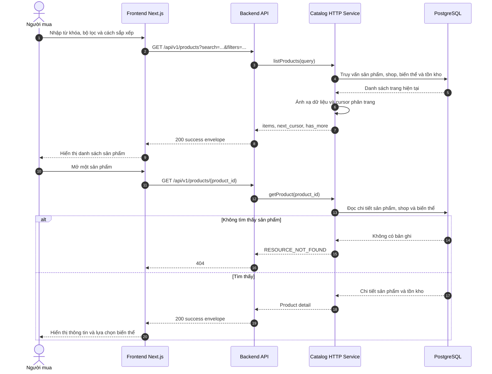

# UC02 — Tìm kiếm và xem sản phẩm

```mermaid
sequenceDiagram
    autonumber
    actor Buyer as Người mua
    participant FE as Frontend Next.js
    participant API as Backend API
    participant Catalog as Catalog HTTP Service
    participant DB as PostgreSQL

    Buyer->>FE: Nhập từ khóa, bộ lọc và cách sắp xếp
    FE->>API: GET /api/v1/products?search=...&filters=...
    API->>Catalog: listProducts(query)
    Catalog->>DB: Truy vấn sản phẩm, shop, biến thể và tồn kho
    DB-->>Catalog: Danh sách trang hiện tại
    Catalog->>Catalog: Ánh xạ dữ liệu và cursor phân trang
    Catalog-->>API: items, next_cursor, has_more
    API-->>FE: 200 success envelope
    FE-->>Buyer: Hiển thị danh sách sản phẩm

    Buyer->>FE: Mở một sản phẩm
    FE->>API: GET /api/v1/products/{product_id}
    API->>Catalog: getProduct(product_id)
    Catalog->>DB: Đọc chi tiết sản phẩm, shop và biến thể
    alt Không tìm thấy sản phẩm
        DB-->>Catalog: Không có bản ghi
        Catalog-->>API: RESOURCE_NOT_FOUND
        API-->>FE: 404
    else Tìm thấy
        DB-->>Catalog: Chi tiết sản phẩm và tồn kho
        Catalog-->>API: Product detail
        API-->>FE: 200 success envelope
        FE-->>Buyer: Hiển thị thông tin và lựa chọn biến thể
    end
```
