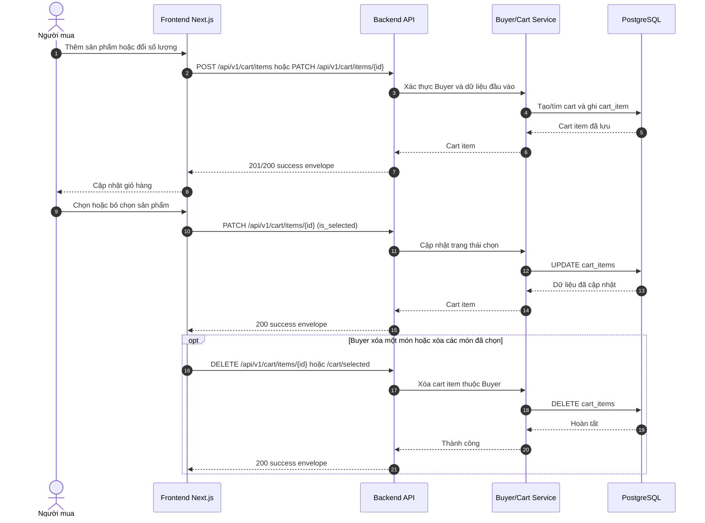

# UC03 — Quản lý giỏ hàng

```mermaid
sequenceDiagram
    autonumber
    actor Buyer as Người mua
    participant FE as Frontend Next.js
    participant API as Backend API
    participant Cart as Buyer/Cart Service
    participant DB as PostgreSQL

    Buyer->>FE: Thêm sản phẩm hoặc đổi số lượng
    FE->>API: POST /api/v1/cart/items hoặc PATCH /api/v1/cart/items/{id}
    API->>Cart: Xác thực Buyer và dữ liệu đầu vào
    Cart->>DB: Tạo/tìm cart và ghi cart_item
    DB-->>Cart: Cart item đã lưu
    Cart-->>API: Cart item
    API-->>FE: 201/200 success envelope
    FE-->>Buyer: Cập nhật giỏ hàng

    Buyer->>FE: Chọn hoặc bỏ chọn sản phẩm
    FE->>API: PATCH /api/v1/cart/items/{id} (is_selected)
    API->>Cart: Cập nhật trạng thái chọn
    Cart->>DB: UPDATE cart_items
    DB-->>Cart: Dữ liệu đã cập nhật
    Cart-->>API: Cart item
    API-->>FE: 200 success envelope

    opt Buyer xóa một món hoặc xóa các món đã chọn
        FE->>API: DELETE /api/v1/cart/items/{id} hoặc /cart/selected
        API->>Cart: Xóa cart item thuộc Buyer
        Cart->>DB: DELETE cart_items
        DB-->>Cart: Hoàn tất
        Cart-->>API: Thành công
        API-->>FE: 200 success envelope
    end
```
