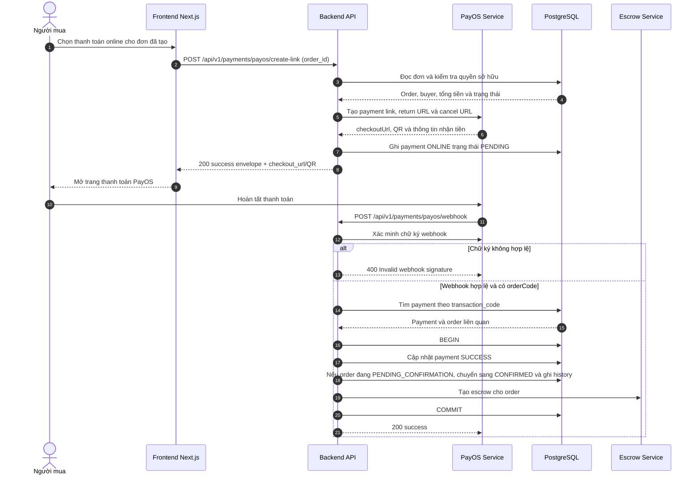

# UC05 — Thanh toán online qua PayOS

```mermaid
sequenceDiagram
    autonumber
    actor Buyer as Người mua
    participant FE as Frontend Next.js
    participant API as Backend API
    participant Pay as PayOS Service
    participant DB as PostgreSQL
    participant Escrow as Escrow Service

    Buyer->>FE: Chọn thanh toán online cho đơn đã tạo
    FE->>API: POST /api/v1/payments/payos/create-link (order_id)
    API->>DB: Đọc đơn và kiểm tra quyền sở hữu
    DB-->>API: Order, buyer, tổng tiền và trạng thái
    API->>Pay: Tạo payment link, return URL và cancel URL
    Pay-->>API: checkoutUrl, QR và thông tin nhận tiền
    API->>DB: Ghi payment ONLINE trạng thái PENDING
    API-->>FE: 200 success envelope + checkout_url/QR
    FE-->>Buyer: Mở trang thanh toán PayOS
    Buyer->>Pay: Hoàn tất thanh toán

    Pay->>API: POST /api/v1/payments/payos/webhook
    API->>Pay: Xác minh chữ ký webhook
    alt Chữ ký không hợp lệ
        API-->>Pay: 400 Invalid webhook signature
    else Webhook hợp lệ và có orderCode
        API->>DB: Tìm payment theo transaction_code
        DB-->>API: Payment và order liên quan
        API->>DB: BEGIN
        API->>DB: Cập nhật payment SUCCESS
        API->>DB: Nếu order đang PENDING_CONFIRMATION, chuyển sang CONFIRMED và ghi history
        API->>Escrow: Tạo escrow cho order
        API->>DB: COMMIT
        API-->>Pay: 200 success
    end
```
