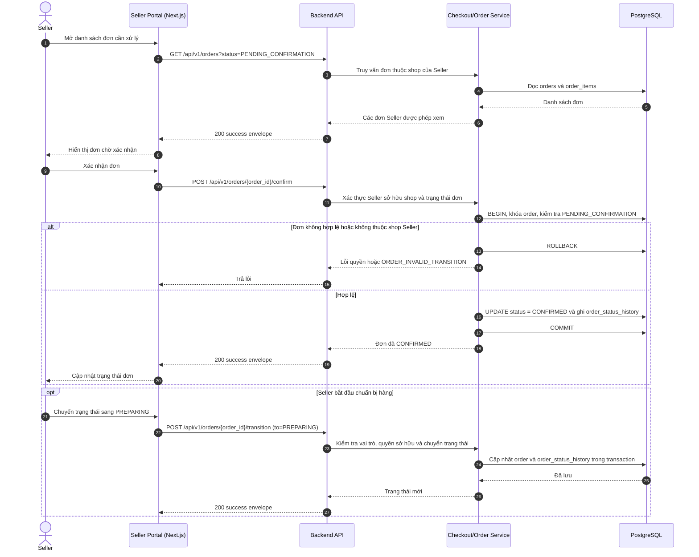

# UC06 — Seller tiếp nhận và xử lý đơn

```mermaid
sequenceDiagram
    autonumber
    actor Seller as Seller
    participant FE as Seller Portal (Next.js)
    participant API as Backend API
    participant Order as Checkout/Order Service
    participant DB as PostgreSQL

    Seller->>FE: Mở danh sách đơn cần xử lý
    FE->>API: GET /api/v1/orders?status=PENDING_CONFIRMATION
    API->>Order: Truy vấn đơn thuộc shop của Seller
    Order->>DB: Đọc orders và order_items
    DB-->>Order: Danh sách đơn
    Order-->>API: Các đơn Seller được phép xem
    API-->>FE: 200 success envelope
    FE-->>Seller: Hiển thị đơn chờ xác nhận

    Seller->>FE: Xác nhận đơn
    FE->>API: POST /api/v1/orders/{order_id}/confirm
    API->>Order: Xác thực Seller sở hữu shop và trạng thái đơn
    Order->>DB: BEGIN, khóa order, kiểm tra PENDING_CONFIRMATION
    alt Đơn không hợp lệ hoặc không thuộc shop Seller
        Order->>DB: ROLLBACK
        Order-->>API: Lỗi quyền hoặc ORDER_INVALID_TRANSITION
        API-->>FE: Trả lỗi
    else Hợp lệ
        Order->>DB: UPDATE status = CONFIRMED và ghi order_status_history
        Order->>DB: COMMIT
        Order-->>API: Đơn đã CONFIRMED
        API-->>FE: 200 success envelope
        FE-->>Seller: Cập nhật trạng thái đơn
    end

    opt Seller bắt đầu chuẩn bị hàng
        Seller->>FE: Chuyển trạng thái sang PREPARING
        FE->>API: POST /api/v1/orders/{order_id}/transition (to=PREPARING)
        API->>Order: Kiểm tra vai trò, quyền sở hữu và chuyển trạng thái
        Order->>DB: Cập nhật order và order_status_history trong transaction
        DB-->>Order: Đã lưu
        Order-->>API: Trạng thái mới
        API-->>FE: 200 success envelope
    end
```
