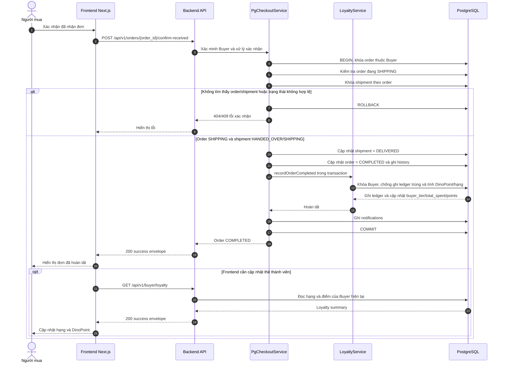

# UC08 — Buyer xác nhận nhận hàng và tích điểm

```mermaid
sequenceDiagram
    autonumber
    actor Buyer as Người mua
    participant FE as Frontend Next.js
    participant API as Backend API
    participant Checkout as PgCheckoutService
    participant Loyalty as LoyaltyService
    participant DB as PostgreSQL

    Buyer->>FE: Xác nhận đã nhận đơn
    FE->>API: POST /api/v1/orders/{order_id}/confirm-received
    API->>Checkout: Xác minh Buyer và xử lý xác nhận
    Checkout->>DB: BEGIN, khóa order thuộc Buyer
    Checkout->>DB: Kiểm tra order đang SHIPPING
    Checkout->>DB: Khóa shipment theo order
    alt Không tìm thấy order/shipment hoặc trạng thái không hợp lệ
        Checkout->>DB: ROLLBACK
        Checkout-->>API: 404/409 lỗi xác nhận
        API-->>FE: Hiển thị lỗi
    else Order SHIPPING và shipment HANDED_OVER/SHIPPING
        Checkout->>DB: Cập nhật shipment = DELIVERED
        Checkout->>DB: Cập nhật order = COMPLETED và ghi history
        Checkout->>Loyalty: recordOrderCompleted trong transaction
        Loyalty->>DB: Khóa Buyer, chống ghi ledger trùng và tính DinoPoint/hạng
        DB-->>Loyalty: Ghi ledger và cập nhật buyer_tier/total_spent/points
        Loyalty-->>Checkout: Hoàn tất
        Checkout->>DB: Ghi notifications
        Checkout->>DB: COMMIT
        Checkout-->>API: Order COMPLETED
        API-->>FE: 200 success envelope
        FE-->>Buyer: Hiển thị đơn đã hoàn tất
        opt Frontend cần cập nhật thẻ thành viên
            FE->>API: GET /api/v1/buyer/loyalty
            API->>DB: Đọc hạng và điểm của Buyer hiện tại
            DB-->>API: Loyalty summary
            API-->>FE: 200 success envelope
            FE-->>Buyer: Cập nhật hạng và DinoPoint
        end
    end
```
