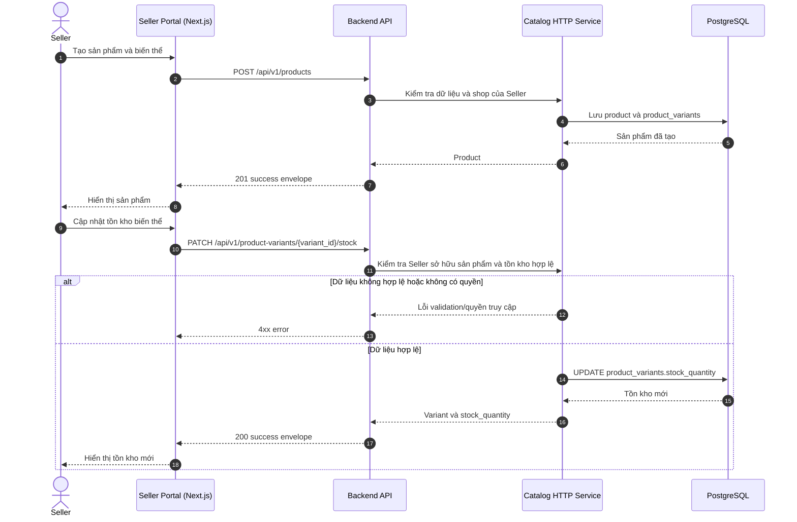

# UC09 — Seller quản lý sản phẩm và tồn kho

```mermaid
sequenceDiagram
    autonumber
    actor Seller as Seller
    participant FE as Seller Portal (Next.js)
    participant API as Backend API
    participant Catalog as Catalog HTTP Service
    participant DB as PostgreSQL

    Seller->>FE: Tạo sản phẩm và biến thể
    FE->>API: POST /api/v1/products
    API->>Catalog: Kiểm tra dữ liệu và shop của Seller
    Catalog->>DB: Lưu product và product_variants
    DB-->>Catalog: Sản phẩm đã tạo
    Catalog-->>API: Product
    API-->>FE: 201 success envelope
    FE-->>Seller: Hiển thị sản phẩm

    Seller->>FE: Cập nhật tồn kho biến thể
    FE->>API: PATCH /api/v1/product-variants/{variant_id}/stock
    API->>Catalog: Kiểm tra Seller sở hữu sản phẩm và tồn kho hợp lệ
    alt Dữ liệu không hợp lệ hoặc không có quyền
        Catalog-->>API: Lỗi validation/quyền truy cập
        API-->>FE: 4xx error
    else Dữ liệu hợp lệ
        Catalog->>DB: UPDATE product_variants.stock_quantity
        DB-->>Catalog: Tồn kho mới
        Catalog-->>API: Variant và stock_quantity
        API-->>FE: 200 success envelope
        FE-->>Seller: Hiển thị tồn kho mới
    end
```
